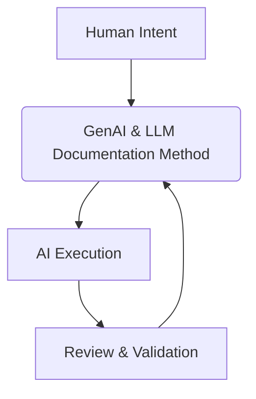

# How to Use This Repository

:::info[Your Learning Path]
This repository is designed to be a practical guide for using Generative AI and LLMs in AI-assisted development. Choose your path based on your role and current needs.
:::

## Overview

The GenAI & LLM Handbook is a professional practice. This repo supports:

-   **Learning the Core Principles**: Understanding _why_ GenAI & LLM Documentation works.
-   **Applying Patterns**: Learning _how_ to apply GenAI & LLM Documentation to common tasks.
-   **Deep Dives**: Exploring specific technical aspects and scenarios.
-   **Contributing**: Extending the repository with your own learnings and patterns.

---

## Repository Structure

This repository is organized to help you navigate from foundational concepts to practical application.

-   **Start Here**
    _What the GenAI & LLM Handbook is, who it is for, and how the framework fits together_
-   **Core Skills**
    _What you must be able to think and write to use the GenAI & LLM Handbook effectively_
-   **Fundamentals**
    _Enough GenAI and LLM theory to avoid misuse_
-   **The GenAI & LLM Handbook Method**
    _How work flows from problem to acceptance using GenAI & LLM Handbook artifacts_
-   **Execution Patterns**
    _Reusable ways to apply the GenAI & LLM Handbook to common tasks_
-   **Professional Scenarios**
    _Real-world examples of the GenAI & LLM Handbook in action for different roles_
-   **Guardrails & Governance**
    _How to use GenAI responsibly, securely, and in compliance_
-   **Evaluation**
    _How to objectively measure the quality and impact of GenAI-assisted work_
-   **Templates**
    _Ready-to-use templates for common artifacts (PRDs, specs, acceptance criteria)_
-   **Tooling**
    _How the GenAI & LLM Handbook is executed using CLI copilots, LLM frameworks, and local setups_
-   **Experiments**
    _Evidence from real usage, including failures and learnings_

---

## Recommended Learning Paths

### If you are new to the GenAI & LLM Handbook:

1. **What is GenAI & LLM**: `docs/00-handbook-introduction/what-is-genai-llm.md`
2.  **Who this is for**: `docs/00-handbook-introduction/01-who-this-is-for.md`
3. **The GenAI & LLM Map**: `docs/00-handbook-introduction/genai-llm-map.md`

### If you want to apply the GenAI & LLM Handbook immediately:

1. **The GenAI & LLM Handbook Loop**: `docs/01-handbook-method/the-genai-llm-loop.md`
2.  Pick an **Execution Pattern** that matches your current task: `docs/04-patterns/00-pattern-index.md`
3. Cross-reference with the map in `docs/00-handbook-introduction/genai-llm-map.md`

### If you want to master the GenAI & LLM Handbook:

1.  Start with **Core Skills**: `docs/01-core-skills/00-core-skills-overview.md`
2. Dive deep into the **GenAI & LLM Handbook Method**: `docs/01-handbook-method/the-genai-llm-loop.md`
3.  Explore **Professional Scenarios**: `docs/05-scenarios/00-scenarios-index.md`
4.  Master **Guardrails & Governance**: `docs/07-guardrails/guardrails-index.md`

---

## The GenAI & LLM Handbook Mindset

The GenAI & LLM Handbook is best understood through application. It is a disciplined approach to managing the interaction between human intent and AI execution.

If you adapt the GenAI & LLM Handbook:

-   **You must assume AI will try to make sense of ambiguous input**, even if it makes things up.
-   **You must assume AI will take the path of least resistance** if constraints are weak.
-   **You must own the outcome.**

The GenAI & LLM Handbook assumes responsibility is non-negotiable.

---

## Visual Navigation

Open `docs/00-handbook-introduction/genai-llm-map.md` for a visual flow of how all parts of the GenAI & LLM Handbook connect into a single working system.
