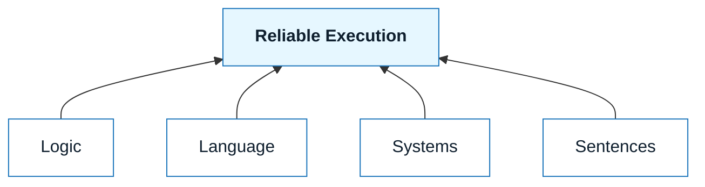
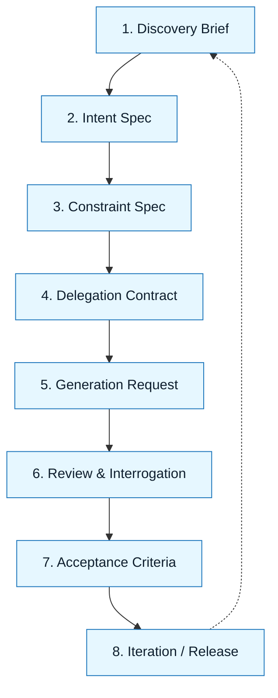

# What is NNLP?

:::info[The Core Promise]
NNLP is for people who want the speed of GenAI **without giving up clarity, correctness, or responsibility.**
:::

## Quick Definition

**NNLP (Nuanced Natural Language Programming)** is a professional framework for building software, documentation, and systems using natural language, with AI as an execution partner. It treats language as a **technical interface**, not a chat prompt.

## Why It Matters

Natural language is now executable. That changes how we build, but it doesn’t remove the need for discipline.

- Ambiguity becomes bugs.
- Missing constraints become scope creep.
- Unstated assumptions become regressions.

Most AI failures are not model failures. They are **human specification failures**. NNLP exists to fix that.

## What NNLP Is (and Is Not)

- **NNLP Is**
  - A **professional framework**
  - Language as a **precise interface**
  - **Human-directed**, AI-assisted
  - Grounded in **logic and systems**

- **NNLP Is Not**
  - Prompt engineering tricks
  - No-code shortcuts
  - Tool hype or silver bullets
  - A replacement for judgment or review

## The Core Idea

Natural language becomes executable only when it is grounded in:

- **Logic** — _cause/effect, invariants, dependencies_
- **Language discipline** — _explicit intent and constraints_
- **Systems thinking** — _boundaries, integrations, failure modes_
- **Sentence-level precision** — _one instruction per sentence_

NNLP formalizes this into a repeatable method.

Core idea diagram: Logic, Language, Systems, and Sentences combine to produce Reliable Execution.

## The NNLP Loop (8 Steps)

**Each step produces a concrete artifact that can be reviewed on its own.** This keeps AI-assisted work accountable and reviewable.

NNLP Loop diagram: Discovery, Intent, Constraints, Delegation, Generation, Review, Acceptance, then Iteration/Release back to Discovery.

## How NNLP Uses AI

AI systems:

- **generate implementations** from clear specifications
- **translate requirements** into code, tests, and docs
- **accelerate** mechanical work
- **surface alternative solutions**

AI does **not**:

- _decide priorities_
- _own trade-offs_
- _validate correctness_
- _accept risk_

Those remain human responsibilities.

## Who NNLP Is For (Signals You’ll Benefit)

- **Engineers and builders** using AI-assisted development who want _fewer regressions_.
- **Product and UX practitioners** translating ambiguity into _specs and acceptance criteria_.
- **Technical writers and enablement teams** using AI _responsibly_.
- **Tech leads and architects** accountable for _long-term system health_.
- **Solo builders** who want habits that _scale_.

If you want shortcuts, this isn’t it. If you want leverage without abdication, it is.

## How to Get Started

- **New to NNLP**: Start with “What NNLP Is,” then the NNLP Map, then Core Skills.
- **Practicing already**: Jump to the NNLP Loop, use Templates, apply to one small real task.
- **Need guardrails**: Read Guardrails & Governance, then Evaluation, before delegating broadly.

## Related Links

- Learn the loop: `docs/03-nnlp-method/00-the-nnlp-loop.md`
- Build core skills: `docs/01-core-skills/00-core-skills-overview.md`
- Use templates: `docs/09-templates/00-templates-index.md`
- See scenarios: `docs/05-professional-scenarios/00-scenarios-index.md`

## Tone and Intent

NNLP is deliberately professional and calm. There are no productivity promises—only a way to work that remains solid as tools change. If that resonates, you are in the right place.
