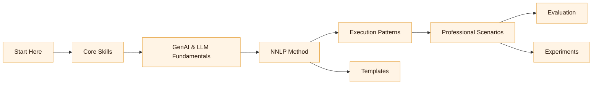

# How to Use This Repo

:::info[Orientation]
This repo is a toolkit, not a course. Skim purposefully, then dive where your current task demands depth.
:::

## Overview

This repository is designed to be used **progressively** and **selectively**.

You do not need to read everything in order.
You do need to understand how the pieces fit together.

NNLP is a professional practice. This repo supports:

- learning
- execution
- review
- reuse

This document explains how to navigate the material without getting lost or overwhelmed.

---

## How the Repo Is Structured

The repo is organized around **capability building**, not chapters or weeks.

Each major section answers a different question:

- **Start Here**
  _What NNLP is, who it is for, and how the framework fits together_

- **Core Skills**
  _What you must be able to think and write to use NNLP effectively_

- **GenAI and LLM Fundamentals**
  _What you need to understand about models to avoid misuse in real work_

- **NNLP Method**
  _How work flows from problem to acceptance using NNLP artifacts_

- **Execution Patterns**
  _Reusable ways to apply NNLP to common tasks_

- **Professional Scenarios**
  _End-to-end examples mapped to real roles and responsibilities_

- **Frameworks and Tooling**
  _How NNLP is executed using CLI copilots, LLM frameworks, and local setups_

- **Guardrails and Governance**
  _How to operate safely, responsibly, and at scale_

- **Evaluation**
  _How to assess quality, correctness, and risk_

- **Templates**
  _Ready-to-use artifacts for professional execution_

- **Experiments**
  _Real-world local and scenario-based practice with documented outcomes_

:::tip[If you feel lost]
Open `docs/00-start-here/03-the-nnlp-map.md` for a visual flow of how these pieces connect.
:::

---

## Recommended Reading Paths

Choose the path that matches your immediate goal.

### Path 1: First-Time Reader (Foundations)

If you are new to NNLP:

1. `docs/00-start-here/00-what-is-nnlp.md`
2. `docs/00-start-here/01-who-this-is-for.md`
3. `docs/00-start-here/03-the-nnlp-map.md`
4. `docs/01-core-skills/00-core-skills-overview.md`

This gives you the mental model without overload.

---

### Path 2: Practitioner Getting Things Done

If you want to apply NNLP immediately:

1. `docs/03-nnlp-method/00-the-nnlp-loop.md`
2. `docs/09-templates/`
3. `docs/04-execution-patterns/`
4. `docs/08-evaluation/`

Use templates and patterns in parallel with your real task.

---

### Path 3: GenAI and LLM Understanding

If you want solid fundamentals without academic overload:

1. `docs/02-genai-llm-fundamentals/00-fundamentals-index.md`
2. Work through sections based on your gaps
3. Cross-reference with the map in `docs/00-start-here/03-the-nnlp-map.md`

This path emphasizes behavior and consequences, not math.

---

### Path 4: Team or Organizational Adoption

If you are responsible for adoption, quality, or governance:

1. `docs/07-guardrails-and-governance/`
2. `docs/08-evaluation/`
3. `docs/03-nnlp-method/09-working-agreements-for-teams.md`
4. `docs/05-professional-scenarios/`

This path focuses on repeatability and risk management.

---

## How to Read Individual Documents

Each document is written to be:

- standalone
- cross-referenced
- reusable

Pay attention to:

- conceptual grounding notes
- links to related skills or methods
- references to templates and patterns

If a document feels abstract, jump to:

- a pattern
- a scenario
- an experiment

NNLP is best understood through application.

---

## Visual Navigation

> 🟧 **How to use this map**
> Start at your need (e.g., scenarios or patterns) and follow arrows backward until you find missing prerequisites.

---

## How to Use Templates and Experiments

### Templates

Templates are meant to be copied and adapted.

Use them to:

- structure thinking before generation
- standardize review and acceptance
- reduce ambiguity across collaborators

They are intentionally simple and opinionated.

---

> 🟦 **Template hygiene**
> Copy templates into your project, then version them. Never edit the originals in place.

### Experiments

Experiments document:

- what was tried
- what worked
- what failed
- why it matters

They are not tutorials or benchmarks.

Read experiments to understand:

- failure modes
- trade-offs
- real constraints

> 🟫 **Takeaway first**
> Read the “why it matters” notes in each experiment before the steps; they distill lessons you can reuse without replicating the entire run.

---

## How to Contribute or Extend

If you adapt NNLP:

- keep artifacts explicit
- document failures as well as successes
- avoid tool-specific hype
- preserve human accountability

See:

- `CONTRIBUTING.md`
- `community/GOVERNANCE.md`

---

## How Not to Use This Repo

Do not:

- skim for prompts and skip thinking
- copy outputs without review
- treat NNLP as a productivity trick
- ignore guardrails and evaluation

NNLP assumes responsibility is non-negotiable.

---

## Next Step

Proceed to:
**`docs/00-start-here/03-the-nnlp-map.md`**

This will show you how all parts of NNLP connect into a single working system.

---

## Last Reviewed / Last Updated

- Last reviewed: 2025-12-20
- Version: 0.1.0
