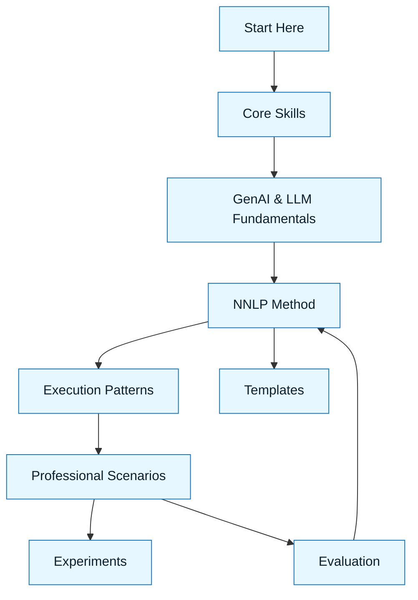

# The NNLP Map

:::info[Purpose]
Use this map to decide where to start, what to read next, and how the pieces connect when you are delivering real work.
:::

## Overview

NNLP is a layered system:

- **Foundations** (Start Here + Core Skills) give you vocabulary and mindset.
- **Behavioral Understanding** (GenAI & LLM Fundamentals) prevents misuse of models.
- **Method** (NNLP Loop + artifacts) turns intent into executable language.
- **Application** (Patterns + Scenarios + Experiments) proves the method under realistic conditions.
- **Governance** (Guardrails + Evaluation) keeps velocity aligned with safety.

This document is the on-ramp: scan once, then jump to the section that matches your need.

---

## Visual Map (High Level)

> 🟧 **How to use this diagram**
> Drop into the box that matches your immediate goal, then follow arrows backward until prerequisites are satisfied.
>
> Mermaid source: `assets/diagrams/nnlp-scenario-map.mmd`

---

## Layer Cheat Sheet

| Layer                        | Answers                               | Start Files                                                                                   |
| ---------------------------- | ------------------------------------- | --------------------------------------------------------------------------------------------- |
| **Start Here**               | What is NNLP? Who is it for?          | `00-what-is-nnlp.md`, `01-who-this-is-for.md`                                                 |
| **Core Skills**              | What human capabilities are required? | `../01-core-skills/00-core-skills-overview.md`                                                |
| **GenAI & LLM Fundamentals** | How do models behave?                 | `../02-genai-llm-fundamentals/00-fundamentals-index.md`                                       |
| **NNLP Method**              | How do the artifacts fit together?    | `../03-nnlp-method/00-the-nnlp-loop.md`                                                       |
| **Execution Patterns**       | How do I apply NNLP to tasks?         | `../04-execution-patterns/00-pattern-index.md`                                                |
| **Professional Scenarios**   | How does this work end-to-end?        | `../05-professional-scenarios/00-scenarios-index.md`                                          |
| **Templates**                | What can I copy and adapt quickly?    | `../09-templates/00-templates-index.md`                                                       |
| **Evaluation & Guardrails**  | How do we stay safe and accountable?  | `../07-guardrails-and-governance/guardrails-index.md`, `../08-evaluation/00-eval-overview.md` |
| **Experiments**              | What happened in practice?            | `../../experiments/README.md`                                                                 |

---

## Two Loops to Keep in View

- **Execution loop (method)**: Discovery → Intent → Constraints → Delegation → Generation → Review → Acceptance → Iteration.
  Visual: `assets/diagrams/nnlp-loop.mmd`

- **Skill loop (growth)**: Assess → Practice → Apply → Reflect → Tighten guardrails.
  Visual: `assets/diagrams/nnlp-skill-matrix.mmd`

> 🟩 **Tip**
> Keep both loops visible in workshops or pairing sessions. One keeps delivery on track; the other keeps humans improving.

---

## Navigation Patterns

- **Need to ship**: Patterns → Method → Templates → Evaluation.
- **Need to align stakeholders**: Start Here → Core Skills (Language + Systems) → Method → Guardrails.
- **Need to upskill a team**: Start Here → Core Skills → Fundamentals → Scenarios → Experiments.
- **Need to de-risk AI usage**: Guardrails → Method (Delegation Contract) → Evaluation → Review & Interrogation.

> 🟥 **Common pitfall**
> Jumping straight to templates without Core Skills leads to brittle specs. Treat templates as accelerators, not substitutes for thinking.

---

## Last Reviewed / Last Updated

- Last reviewed: 2025-12-20
- Version: 0.1.0
