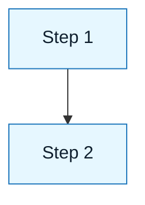

# Documentation Style Guide

:::info[Purpose]
This document defines the visual and structural standards for the NNLP repository. Use it to maintain consistency across all documentation.
:::

## Core Philosophy

NNLP documentation is written to be **executable** by humans.
It follows the same principles as the framework itself:

- **Logic**: Clear cause and effect in explanations.
- **Language**: Precise, unambiguous terminology.
- **Systems**: Consistent structure and linking.
- **Sentences**: One instruction per sentence.

We value **scannability over density**.

---

## Tone and Voice

- **Professional**: Calm, authoritative, and grounded.
- **Direct**: Avoid fluff. Use active voice.
- **No Hype**: Avoid marketing terms ("game-changer", "revolutionary").
- **Human-Centric**: Focus on the practitioner's responsibility.

**Bad**: "This amazing tool leverages the power of AI to supercharge your workflow!"
**Good**: "This tool automates mechanical tasks, allowing you to focus on logic."

---

## Frontmatter Standard

Every Markdown file must start with this YAML block:

```yaml
---
title: "Document Title"
archetype: "foundation | core-skill | method | pattern | scenario | experiment | template"
status: "active | draft | deprecated"
owner: "Name (Handle)"
maintainer: "Name (Handle)"
version: "0.1.0"
tags: ["tag1", "tag2"]
last_reviewed: "YYYY-MM-DD"
---
```

---

## Admonition System

We use Docusaurus-style admonitions to create visual hierarchy. Do not use blockquotes (`>`) for these.

### 1. Info (Blue)

Use for context, core promises, or "why this matters".

```markdown
:::info[The Core Promise]
NNLP is for people who want speed without giving up control.
:::
```

### 2. Tip (Green)

Use for actionable advice, shortcuts, or micro-practices.

```markdown
:::tip[Micro-practice]
Rewrite "handle errors" into a testable sentence.
:::
```

### 3. Warning (Orange)

Use for checklists, prerequisites, or common pitfalls.

```markdown
:::warning[Checklist]
Do not proceed until you have defined your constraints.
:::
```

### 4. Danger (Red)

Use for "stop" conditions, fail-fast rules, or high-risk actions.

```markdown
:::danger[Stop here]
If you cannot state the failure mode, do not generate code.
:::
```

---

## Formatting Standards

### Text Emphasis

- **Bold (`**text**`)**: Use for key terms, actors, and "Is" statements in tables.
- _Italics (`\_text_`)\_: Use for descriptions, "Is Not" statements, and anti-patterns.
- `Code` (` `text` `): Use for file paths, artifact names, and literal strings.

### Tables

Use tables for comparisons and matrices. Align text left (`:---`).

| Header 1      | Header 2             |
| :------------ | :------------------- |
| **Bold Item** | _Italic Description_ |

---

## Diagram Standards

Use Mermaid.js for all diagrams.

- **Flowcharts**: Use `TD` (Top-Down) or `LR` (Left-Right) based on fit.
- **Styling**: Use the standard NNLP class definitions for consistency.



---

## Last Reviewed / Last Updated

- Last reviewed: 2025-12-20
- Version: 0.1.0
