# Core Skills Overview

:::info[If you read one thing]
Tools don’t make NNLP work—people do. These four skills determine whether AI accelerates you or creates risk.
:::

## Overview

NNLP is not powered by tools.
It is powered by **human capability**.

Before methods, patterns, or frameworks, NNLP depends on four core skills that determine whether natural language execution succeeds or fails:

- Logic
- Language
- Systems
- Sentences

These skills are not optional. They compound each other. Weakness in one will surface as errors, drift, or risk later in the workflow.

This section explains what these skills mean in the context of NNLP and why they matter professionally.

---

## At a Glance

| Skill         | Focus                                          | ⚠️ Without it…                                |
| :------------ | :--------------------------------------------- | :-------------------------------------------- |
| **Logic**     | Cause/effect, invariants, dependencies         | _Specs sound right but fail in practice_      |
| **Language**  | Clarity, explicit scope, deterministic wording | _Ambiguity turns into unpredictable behavior_ |
| **Systems**   | Boundaries, integration, failure modes         | _Local fixes break global reliability_        |
| **Sentences** | One instruction per sentence                   | _Models merge or ignore constraints_          |

:::danger[Fail-fast rule]
If one skill is weak, slow down generation and shore it up before delegating to AI.
:::

---

## Why Skills Matter More Than Tools

AI tools amplify whatever thinking you bring to them.

- Clear thinking scales into reliable systems
- Vague thinking scales into brittle automation
- Ambiguity scales into risk

NNLP treats skill-building as the primary leverage point.
Tools are secondary and replaceable.

---

## Visual: How Skills Combine

```mermaid
flowchart LR
    L[🧠 Logic] --> R[✅ Reliable Outcomes]
    Lang[🗣️ Language] --> R
    S[🏗️ Systems] --> R
    Sent[✍️ Sentences] --> R
    R --> Confidence[📈 Confidence Up]
    R --> Risk[📉 Risk Down]

    classDef skill fill:#ffffff,stroke:#1B75BB,color:#0F1F2E;
    classDef outcome fill:#E6F7FF,stroke:#1B75BB,color:#0F1F2E,font-weight:bold;
    class L,Lang,S,Sent skill;
    class R,Confidence,Risk outcome;
```

Mermaid source: `assets/diagrams/nnlp-skill-matrix.mmd`

---

## The Four Core Skills

### 1. Logic

Logic governs **why** something should work.

In NNLP, logic means:

- reasoning about cause and effect
- understanding conditions, invariants, and dependencies
- anticipating downstream consequences
- knowing what must remain true for a system to behave correctly

Without logic:

- constraints are incomplete
- edge cases are missed
- AI output appears plausible but fails in practice

Logic anchors intent in reality.

:::warning[Checklist before you move on]
Can you state preconditions, invariants, dependencies, and failure modes in one breath? If not, revisit logic.
:::

---

### 2. Language

Language governs **how intent is expressed**.

In NNLP, language means:

- treating words as precise instruments
- choosing terms that reduce ambiguity
- structuring information so it can be interpreted consistently
- separating goals, constraints, and instructions clearly

Without language discipline:

- intent becomes fuzzy
- specifications become open-ended
- AI fills gaps unpredictably

Language is not decoration.
It is a technical interface.

:::tip[Micro-practice]
Rewrite “handle errors gracefully” into a measurable, testable sentence.
:::

---

### 3. Systems

Systems thinking governs **how parts interact**.

In NNLP, systems means:

- understanding architecture and boundaries
- reasoning about integration points
- anticipating failure modes
- thinking beyond the local task

Without systems thinking:

- solutions work in isolation but fail in context
- changes introduce regressions
- AI-generated code optimizes locally and breaks globally

Systems thinking protects long-term integrity.

:::warning[Boundary guard]
Before generating, write down what is explicitly _out of scope_. It prevents AI from bleeding across boundaries.
:::

---

### 4. Sentences

Sentences govern **where meaning is decided**.

In NNLP, sentences mean:

- attention to sentence-level structure
- encoding constraints, priorities, and exclusions explicitly
- understanding that small linguistic shifts can change behavior
- avoiding compound or overloaded instructions

Without sentence-level precision:

- instructions collapse into ambiguity
- models misinterpret emphasis
- reviews become harder because intent is unclear

Sentences are the smallest unit of execution in NNLP.

:::tip[Tuning trick]
Split any sentence with “and” or “but” into two sentences. Watch ambiguity drop immediately.
:::

---

## How These Skills Work Together

These skills do not operate independently.

- Logic determines what is valid
- Language determines how intent is framed
- Systems determine where intent applies
- Sentences determine how intent is interpreted

You can express this as:

> **NNLP = Logic × Language × Systems × Sentences**

If any factor is zero, the outcome degrades.

---

## Practice Loop

1. Pick one upcoming task.
2. Draft intent and constraints.
3. Run the checklists in each skill section.
4. Only then craft the generation request.
5. Review outputs against the same checklists.

:::info[Time-saver]
This loop shortens regeneration cycles by catching defects before the model sees them.
:::

---

## Common Failure Patterns When Skills Are Weak

- Strong language, weak logic
  Polished instructions that encode incorrect assumptions

- Strong logic, weak language
  Correct thinking expressed ambiguously

- Strong local logic, weak systems
  Solutions that break integration or scale

- Strong ideas, weak sentences
  Instructions that models misread or overgeneralize

NNLP exists to surface and correct these failure modes early.

---

## Skill Development Is Ongoing

NNLP does not assume mastery upfront.

This repo supports skill growth through:

- focused skill documents
- execution patterns
- professional scenarios
- experiments and failure analysis
- evaluation rubrics

Each subsequent section of the repo reinforces one or more of these skills.

---

## Where to Go Next

Each core skill is explored in depth in the following documents:

1. `docs/01-core-skills/01-logic.md`
2. `docs/01-core-skills/02-language.md`
3. `docs/01-core-skills/03-systems.md`
4. `docs/01-core-skills/04-sentences.md`

Read them in order, or jump to the one that matches your current gap.

---

## Last Reviewed / Last Updated

- Last reviewed: 2025-12-20
- Version: 0.1.0
