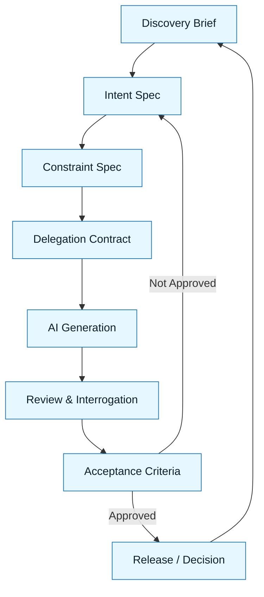
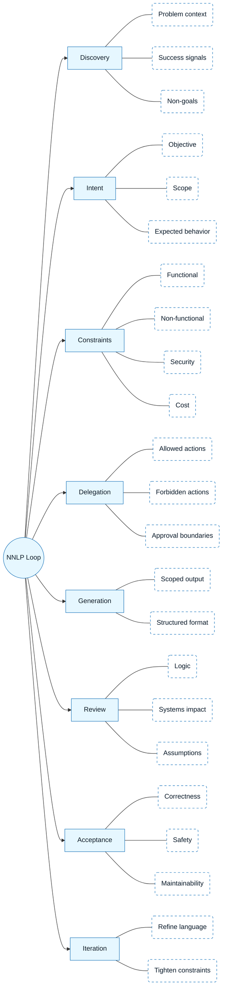

# The NNLP Loop

:::info[Purpose]
The NNLP Loop is the engine of the framework. It turns abstract intent into concrete, reviewable artifacts through a repeatable 8-step process.
:::

## Overview

The NNLP Loop defines **how work actually flows** when you use natural language to build software, documentation, or systems with AI.

It is not a prompt cycle.
It is not a coding shortcut.

It is a **professional execution loop** designed to preserve clarity, accountability, and correctness while using AI as an execution partner.

The loop is intentionally repeatable and interruptible.

---

## Why a Loop (Not a Pipeline)

Pipelines assume certainty.
Real-world work does not.

NNLP assumes:

- partial information
- evolving requirements
- changing constraints
- probabilistic outputs

A loop allows:

- early correction
- controlled iteration
- learning from failure
- responsibility at every step

---

## The NNLP Loop (At a Glance)

The loop consists of **eight stages**.
Each stage produces an artifact that can be reviewed independently.

1. Discovery Brief
2. Intent Spec
3. Constraint Spec
4. Delegation Contract
5. Generation
6. Review & Interrogation
7. Acceptance Criteria
8. Iteration or Release

:::danger[Critical Rule]
Skipping steps does not make you faster. It makes failures more expensive.
:::

---

## Stage-by-Stage Breakdown

### 1. Discovery Brief

**Purpose:** Understand the real problem before proposing solutions.

You capture:

- business or user need
- current state
- desired outcome
- success signals
- non-goals

This stage prevents solution-first thinking.

Artifact:

- `discovery-brief.md`

---

### 2. Intent Spec

**Purpose:** Define what success looks like without prescribing implementation.

You state:

- primary objective
- scope
- expected behavior
- exclusions

Intent is **what must be achieved**, not how.

Artifact:

- `intent-spec.md`

---

### 3. Constraint Spec

**Purpose:** Encode non-negotiables and trade-offs.

You define:

- functional constraints
- non-functional constraints
- compatibility requirements
- performance or cost limits
- security and compliance needs

Constraints protect the system from overreach.

Artifact:

- `constraint-spec.md`

---

### 4. Delegation Contract

**Purpose:** Decide what the AI is allowed to do and what it must not decide.

You specify:

- what can be generated
- what requires human approval
- what is explicitly forbidden
- expected output format

:::warning[Risk]
Delegation without a contract is abdication.
:::

Artifact:

- `delegation-contract.md`

---

### 5. Generation

**Purpose:** Let AI execute within defined boundaries.

You request:

- scoped changes
- structured output
- small, reviewable diffs

Generation is treated as **mechanical execution**, not decision-making.

Artifact:

- generated output (code, docs, diffs)

---

### 6. Review & Interrogation

**Purpose:** Verify logic, system impact, and constraint compliance.

You check:

- alignment with intent
- respect for constraints
- system-level impact
- unstated assumptions
- failure modes

Review is evidence-based, not aesthetic.

Artifact:

- review notes or checklist

---

### 7. Acceptance Criteria

**Purpose:** Decide whether the output is acceptable.

You evaluate:

- correctness
- completeness
- safety
- maintainability

Acceptance is binary: ready or not ready.

Artifact:

- acceptance-criteria.md
- scenario scorecard (optional)

---

### 8. Iteration or Release

**Purpose:** Either refine or finalize.

If gaps exist:

- tighten language
- adjust constraints
- regenerate selectively

If acceptable:

- release
- document decisions
- feed learnings back into discovery

The loop closes and reopens intentionally.

---

## NNLP Loop Diagram (System View)

System view diagram of the NNLP loop: Discovery, Intent, Constraints, Delegation, Generation, Review, Acceptance, then Release/Decision, with a return to Discovery.

---

## NNLP Loop (Mind Map View)

Mind map view of the NNLP loop showing the eight stages branching into their key elements.

---

## How the NNLP Loop Prevents Failure

The loop:

- forces clarity before generation
- makes assumptions visible
- localizes mistakes early
- prevents silent scope creep
- preserves human accountability

Most AI failures happen when **generation precedes intent and constraints**.

NNLP inverts that order deliberately.

---

## When to Pause the Loop

Pause if:

- intent cannot be stated clearly
- constraints are still debated
- system boundaries are unclear
- review reveals conceptual errors

Pausing is a professional act.

---

## Relationship to Tools

The NNLP Loop is **tool-agnostic**.

It works with:

- Codex CLI
- Claude Code
- Aider
- Cursor
- Local LLMs

Tools execute the loop.
They do not define it.

---

## Where This Fits in the Repo

- Method backbone: `docs/03-nnlp-method/`
- Templates: `docs/09-templates/`
- Experiments: `experiments/scenario-labs/`
- Governance: `docs/07-guardrails-and-governance/`

Many documents will link back here.

---

## Next Recommended Documents

After this, read:

1. `docs/03-nnlp-method/01-discovery-brief.md`
2. `docs/03-nnlp-method/02-intent-spec.md`

These operationalize the loop step by step.

---

## Last Reviewed / Last Updated

- Last reviewed: 2025-12-20
- Version: 0.1.0
