# Discovery Brief

:::info[Purpose]
The Discovery Brief prevents "solution-first" thinking. It forces you to define the problem and success signals before asking AI to write a single line of code.
:::

## Overview

AI is an eager pleaser. If you give it a vague problem, it will hallucinate a specific solution immediately.

The **Discovery Brief** is a short, structured artifact that anchors the work in reality. It answers:

- What is the actual problem?
- Why are we solving it now?
- What does "done" look like?
- What are we **not** doing?

It is the "Step 0" of the NNLP Loop.

---

## Why It Matters

In traditional development, ambiguity is clarified during coding.
In AI-assisted development, ambiguity is **amplified** into code.

If you skip discovery:

- You get code that works but solves the wrong issue.
- You waste tokens and time iterating on fundamental misunderstandings.
- You lose the ability to verify if the output is actually useful.

:::warning[The Trap]
The faster the tool, the harder you must think about direction. Speed in the wrong direction is just expensive waste.
:::

---

## What Goes Into a Discovery Brief

A good brief is concise (often 10-20 lines). It contains four specific sections:

### 1. Problem Statement

A clear, non-technical description of the gap or pain point.

- **Bad**: "We need to add Redis." (Solution)
- **Good**: "User sessions are lost during deployments, causing forced logouts." (Problem)

### 2. Context & Background

Relevant facts the AI (and human reviewers) need to know.

- Existing systems involved
- Recent changes
- Business constraints

### 3. Success Signals

Observable outcomes that define success.

- "Session persists across a service restart."
- "Latency does not increase by more than 5%."

### 4. Non-Goals (Out of Scope)

Explicit boundaries to prevent scope creep.

- "We are NOT refactoring the auth service."
- "We are NOT changing the database schema."

---

## Visual: Where It Fits

```mermaid
flowchart LR
    Start((Start)) --> Disc[Discovery Brief]
    Disc --> Intent[Intent Spec]
    Disc --> Stop[🛑 Stop / Pivot]

    classDef step fill:#E6F7FF,stroke:#1B75BB,color:#0F1F2E;
    classDef stop fill:#FFE6E6,stroke:#D32F2F,color:#0F1F2E;
    class Disc,Intent step;
    class Stop stop;
```

Discovery is a decision point. If you cannot write a clear brief, **do not proceed** to the Intent Spec.

---

## Common Anti-Patterns

| Anti-Pattern              | Symptom                                             | Correction                                                 |
| :------------------------ | :-------------------------------------------------- | :--------------------------------------------------------- |
| **The "Just Fix It"**     | Jumping straight to prompts with a vague complaint. | Stop. Write down _what_ is broken.                         |
| **The Tech Prescription** | "Implement X pattern using Y library."              | Ask _why_ first. Move implementation to the Intent Spec.   |
| **The Empty Scope**       | No non-goals listed.                                | AI will refactor everything it touches. Define boundaries. |

---

## Checklist: Is It Ready?

Before moving to the **Intent Spec**, verify:

- [ ] Does the problem statement describe a _need_, not a _solution_?
- [ ] Are success signals observable/measurable?
- [ ] Is there at least one explicit non-goal?
- [ ] Could a new team member understand the "why" from this document alone?

:::tip[Pro Tip]
If writing the brief feels hard, it means you don't understand the problem yet. The brief just saved you 4 hours of debugging AI code.
:::

---

## Next Step

Once the brief is clear, translate it into executable goals:
**`docs/03-nnlp-method/02-intent-spec.md`**

---

## Last Reviewed / Last Updated

- Last reviewed: 2025-12-20
- Version: 0.1.0
