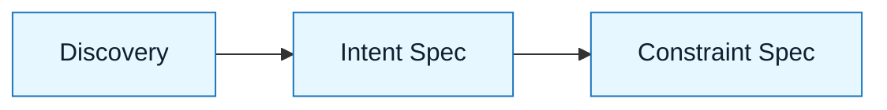

# Intent Spec

:::info[Purpose]
The Intent Spec defines **what** the system must do, without prescribing **how** it does it. It serves as the primary source of truth for correctness.
:::

## Overview

Once you have a clear problem (Discovery Brief), you need to define the solution's shape.

The **Intent Spec** captures the desired outcome in a way that is:

1.  **Implementation-agnostic**: No code, no libraries, no schemas.
2.  **Falsifiable**: You can clearly say if the intent was met or not.
3.  **Scoped**: It explicitly states what is _not_ happening.

It is the bridge between "we have a problem" and "we are writing code."

---

## Why It Matters

AI models love to jump to implementation. If you ask them to "fix the login," they will pick a library, a pattern, and a style immediately.

If you don't define the intent first:

- The model picks the implementation path (often the most generic one).
- You lose the ability to judge if the solution is "correct" or just "compiles."
- Scope creep happens instantly as the model "improves" adjacent code.

:::warning[Rule of Thumb]
If you mention a specific database column or function name in the Intent Spec, you are writing a Constraint Spec or a prompt. Back up.
:::

---

## What Goes Into an Intent Spec

### 1. Primary Objective

The single, overarching goal.
_Example: "Allow users to recover their account using a verified phone number."_

### 2. Scope (In Bounds)

The specific areas of the system that are allowed to change.
_Example: "Login flow, User Profile Service, SMS Gateway integration."_

### 3. Exclusions (Out of Bounds)

Explicit guardrails against scope creep.
_Example: "Do not change the email recovery flow. Do not refactor the User model."_

### 4. Expected Behavior

A description of the user or system experience.
_Example: "When the user enters a code, if valid, they are redirected to the dashboard. If invalid, they see a retry prompt."_

---

## Visual: Where It Fits

The Intent Spec feeds directly into the **Constraint Spec**, where you will add the technical "how" (libraries, patterns, schemas).

---

## Common Anti-Patterns

| Anti-Pattern             | Symptom                                 | Correction                                               |
| :----------------------- | :-------------------------------------- | :------------------------------------------------------- |
| **The Pseudo-Code Spec** | Writing code in the spec.               | Describe the _behavior_, not the syntax.                 |
| **The "Make it Better"** | Vague goals like "improve performance." | Define the measurable outcome (e.g., "Latency < 200ms"). |
| **The Open Loop**        | No exclusions listed.                   | The AI will rewrite files you didn't want touched.       |

---

## Next Step

Now that you know **what** to build, define the technical boundaries:
**`docs/03-nnlp-method/03-constraint-spec.md`**

---

## Last Reviewed / Last Updated

- Last reviewed: 2025-12-20
- Version: 0.1.0
