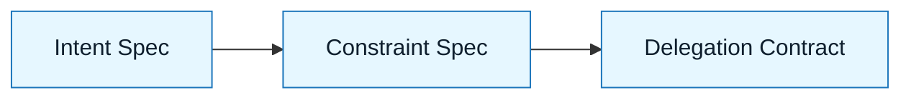

# Constraint Spec

:::info[Purpose]
The Constraint Spec defines the non-negotiable boundaries of the solution. It tells the AI what it **cannot** do, even if it thinks it's a good idea.
:::

## Overview

The Intent Spec defines **what** to build. The Constraint Spec defines the **box** it must fit in.

AI models default to the "average" solution found in their training data. They do not know your:

- Legacy support requirements
- Security policies
- Performance budgets
- Forbidden libraries

The Constraint Spec encodes these invisible requirements into explicit text.

---

## Why It Matters

Without constraints, AI optimizes for **plausibility** and **speed**.

This leads to:

- New dependencies you didn't want (e.g., adding `lodash` for one function).
- Security regressions (e.g., hardcoding secrets).
- Architectural drift (e.g., putting business logic in controllers).

:::warning[The Reality]
If you don't state a constraint, the model assumes it doesn't exist.
:::

---

## What Goes Into a Constraint Spec

### 1. Technical Stack & Versions

Lock down the environment.
_Example: "Must use Python 3.9. Must use `pydantic` v2."_

### 2. Architecture Patterns

Enforce code style and structure.
_Example: "Business logic must live in `services/`. Do not put logic in API handlers."_

### 3. Performance & Cost

Set measurable limits.
_Example: "Max payload size: 1MB. No N+1 queries."_

### 4. Security & Compliance

Explicit prohibitions.
_Example: "No raw SQL. No logging of PII."_

---

## Visual: Where It Fits

Constraints filter the Intent. They reduce the solution space, making the AI's job easier and the output safer.

---

## Common Anti-Patterns

| Anti-Pattern             | Symptom                                      | Correction                                          |
| :----------------------- | :------------------------------------------- | :-------------------------------------------------- |
| **The "Best Practices"** | Asking for "clean code" or "best practices." | Be specific. "Use PEP8" or "Use functional style."  |
| **The Silent Stack**     | Not mentioning versions.                     | AI uses deprecated syntax or hallucinated features. |
| **The Soft Limit**       | "Make it fast."                              | "Response time under 200ms."                        |

---

## Checklist: Is It Ready?

Before moving to the **Delegation Contract**, verify:

- [ ] Are versions explicit?
- [ ] Are "Must Not" rules clearly listed?
- [ ] Is the architectural pattern defined?
- [ ] If the AI follows this, will the code pass CI/CD?

---

## Next Step

Now that the box is defined, give the AI permission to act:
**`docs/03-nnlp-method/04-delegation-contract.md`**

---

## Last Reviewed / Last Updated

- Last reviewed: 2025-12-20
- Version: 0.1.0
