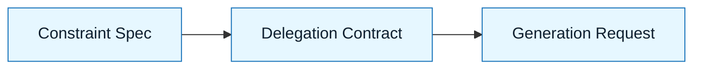

# Delegation Contract

:::info[Purpose]
The Delegation Contract explicitly defines the authority granted to the AI. It separates "assistance" from "autonomy" by defining what the model is allowed to touch, decide, and execute.
:::

## Overview

You have defined the problem (Discovery), the goal (Intent), and the boundaries (Constraints).
Now you must define the **working relationship**.

The **Delegation Contract** answers:

- What role is the AI playing?
- What files can it modify?
- What decisions must it escalate to a human?
- What is the expected output format?

It is the "rules of engagement" for the session.

---

## Why It Matters

AI tools often behave like over-eager interns. They will delete files, rewrite configuration, or hallucinate APIs if they think it helps solve the immediate prompt.

Without a contract:

- The AI might refactor code you didn't ask it to touch.
- It might make architectural decisions (like adding libraries) implicitly.
- You lose track of what was generated vs. what was engineered.

:::warning[The Risk]
Delegation without a contract is abdication. If you don't set limits, the model sets them for you (usually incorrectly).
:::

---

## What Goes Into a Delegation Contract

### 1. Role Definition

Set the persona and competence level.
_Example: "Act as a Senior Site Reliability Engineer. Be conservative and prioritize safety."_

### 2. Scope of Authority (Read/Write)

Explicitly list accessible areas.
_Example: "You may read `src/`. You may ONLY write to `src/components/Button.tsx`."_

### 3. Decision Boundaries

What requires human approval.
_Example: "If you need to change `package.json`, stop and ask for permission."_

### 4. Output Format

How the result should be delivered.
_Example: "Return a single code block. Do not explain the code. Include comments for complex logic."_

---

## Visual: Where It Fits

The Delegation Contract is the final gate before you let the AI generate code.

---

## Common Anti-Patterns

| Anti-Pattern         | Symptom                                        | Correction                                        |
| :------------------- | :--------------------------------------------- | :------------------------------------------------ |
| **The "Do It All"**  | "Fix the app."                                 | Scope the request to a specific file or function. |
| **The Silent Agent** | Running autonomous loops without review steps. | Require a "plan" step before "execute".           |
| **The Drift**        | AI changes coding style mid-file.              | Enforce style in the contract or constraints.     |

---

## Next Step

With the contract signed (metaphorically), you are ready to generate:
**`docs/03-nnlp-method/05-generation-requests.md`**

---

## Last Reviewed / Last Updated

- Last reviewed: 2025-12-20
- Version: 0.1.0
