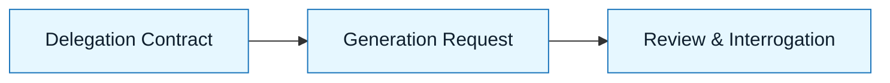

# Generation Request

:::info[Purpose]
The Generation Request is the "Go" button. It combines your intent, constraints, and delegation contract into a single, structured instruction for the AI.
:::

## Overview

You have defined the work (Intent), the boundaries (Constraints), and the rules (Delegation).
Now you must package this context so the AI can execute it.

A **Generation Request** is not a chat message. It is a **context injection**.

It answers:

- Who is the AI acting as?
- What context does it need?
- What is the specific task right now?
- How should the output look?

---

## Why It Matters

Most "bad AI code" comes from "lazy prompting."
If you just type "fix the bug," the AI has to guess the context, the style, and the constraints.

By structuring the request, you:

- Force the model to attend to your constraints.
- Reduce the chance of hallucination.
- Make the output deterministic and reviewable.

:::warning[Context Window]
Do not paste your entire codebase. Paste the _relevant_ specs and the _specific_ files involved.
:::

---

## Anatomy of a Generation Request

### 1. The Primer (Role & Tone)

Establish the persona.
_Example: "Act as a Senior Engineer. Be terse."_

### 2. The Context (Artifact Injection)

Paste the artifacts you created in previous steps.

- Intent Spec
- Constraint Spec
- Delegation Contract

### 3. The Task (Immediate Instruction)

The specific thing to do _in this turn_.
_Example: "Implement the `User` class based on the Intent Spec."_

### 4. The Output Format

How you want the result.
_Example: "Output only the code block."_

---

## Visual: Where It Fits

The Generation Request is the bridge between _planning_ and _execution_.

---

## Common Anti-Patterns

| Anti-Pattern           | Symptom                                                 | Correction                              |
| :--------------------- | :------------------------------------------------------ | :-------------------------------------- |
| **The "Naked Prompt"** | Asking "Write code for X" with no specs.                | Paste the Intent and Constraints first. |
| **The "Mega Prompt"**  | Pasting 50 files unrelated to the task.                 | Scope context to relevant files only.   |
| **The "Drift"**        | Changing requirements in the prompt, ignoring the spec. | Update the spec first, then prompt.     |

---

## Checklist: Is It Ready?

Before hitting enter:

- [ ] Did I include the **Constraint Spec**?
- [ ] Is the **Delegation Contract** clear?
- [ ] Is the specific task unambiguous?
- [ ] Did I specify the output format?

---

## Next Step

Once the AI generates code, you must verify it:
**`docs/03-nnlp-method/06-review-and-interrogation.md`**

---

## Last Reviewed / Last Updated

- Last reviewed: 2025-12-20
- Version: 0.1.0
