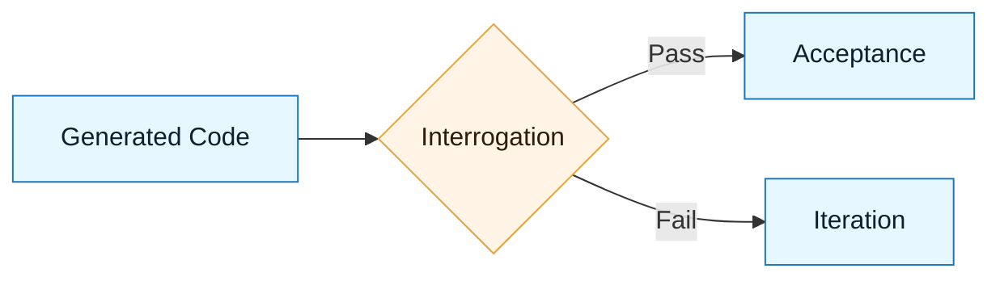

# Review and Interrogation

:::info[Purpose]
Review is passive; interrogation is active. This step verifies that the AI's output actually matches the Intent and Constraint specs before you accept it.
:::

## Overview

In traditional development, code review happens after a human has thought deeply about the problem.
In AI-assisted development, **generation happens fast**, often bypassing deep thought.

Therefore, the review step must be **more rigorous**, not less.

We call this **Interrogation** because you must actively question the code:

- "What happens if I pass null here?"
- "Did you actually import that library, or just use it?"
- "Does this violate the constraint I set about dependencies?"

---

## Why It Matters

AI models suffer from **plausibility bias**. They generate code that _looks_ correct but may be subtly wrong.

If you just "scan" the code, you will miss:

- Hallucinated imports
- Logic gaps in edge cases
- Silent security regressions

:::warning[The Rule]
If you cannot explain _why_ the generated code works, you cannot merge it.
:::

---

## The Interrogation Process

### 1. Intent Check (The "What")

Compare the output against the **Intent Spec**.

- Did it achieve the primary objective?
- Did it respect the exclusions?

### 2. Constraint Check (The "Box")

Compare the output against the **Constraint Spec**.

- Did it use forbidden libraries?
- Did it follow the architectural pattern?

### 3. Logic & Systems Check (The "How")

Apply your Core Skills.

- **Logic**: Are preconditions checked? Are failure modes handled?
- **Systems**: Does this break downstream consumers?

---

## Visual: The Filter

---

## Common Anti-Patterns

| Anti-Pattern           | Symptom                                     | Correction                                        |
| :--------------------- | :------------------------------------------ | :------------------------------------------------ |
| **The "LGTM"**         | Merging because it "looks like code."       | Run the code. Test the edge cases.                |
| **The "Fix-it-Later"** | Accepting bad style with plans to refactor. | Reject it. Make the AI fix it now.                |
| **The "Black Box"**    | Merging code you don't understand.          | Ask the AI to explain it. If it can't, delete it. |

---

## Checklist: Ready for Acceptance?

- [ ] Does the code compile/run?
- [ ] Are there any new dependencies? (Check `package.json` / `requirements.txt`)
- [ ] Did the AI hallucinate any APIs?
- [ ] Does it handle failure, or just the happy path?

---

## Next Step

If it passes interrogation, formalize the decision:
**`docs/03-nnlp-method/07-acceptance-criteria.md`**
