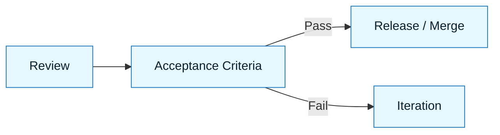

# Acceptance Criteria

:::info[Purpose]
Acceptance Criteria define the binary condition of "Done." They move the conversation from "I think it works" to "It passed these specific tests."
:::

## Overview

You have generated code and reviewed it. Now you must decide: **Is this ready to ship?**

Acceptance Criteria are the specific, observable conditions that the software must meet to be accepted. They are derived directly from the **Intent Spec** (what it should do) and the **Constraint Spec** (what it should not do).

In NNLP, acceptance is not a feeling. It is a checklist.

---

## Why It Matters

AI is probabilistic. It can generate code that looks perfect but fails on edge cases.
Humans are prone to "LGTM" (Looks Good To Me) fatigue, especially after iterating with a bot.

Explicit acceptance criteria:

- Prevent "vibes-based" merging.
- Catch regressions in adjacent systems.
- Provide a clear audit trail for why a change was approved.

:::warning[The Standard]
If you cannot verify it, you cannot accept it.
:::

---

## What Goes Into Acceptance Criteria

### 1. Functional Verification

Does the feature do what the Intent Spec promised?
_Example: "User can log in with valid credentials."_

### 2. Negative Testing

Does the system handle failure as defined in the Logic skill?
_Example: "System returns 403 Forbidden for invalid credentials (not 500 Error)."_

### 3. Constraint Verification

Did we respect the boundaries?
_Example: "No new npm packages were added."_

### 4. System Integrity

Did we break anything else?
_Example: "The build passes and existing tests are green."_

---

## Visual: Where It Fits

Acceptance is the gatekeeper. It is the final step before code leaves the NNLP loop.

---

## Common Anti-Patterns

| Anti-Pattern            | Symptom                                                            | Correction                                                                        |
| :---------------------- | :----------------------------------------------------------------- | :-------------------------------------------------------------------------------- |
| **The "LGTM"**          | Merging because the code "looks" clean.                            | Run the code. Verify inputs/outputs.                                              |
| **The Moving Goalpost** | Accepting partial functionality because "it's better than before." | If it doesn't meet the Intent Spec, it's a fail. Update the spec or fix the code. |
| **The Happy Path Only** | Testing only valid inputs.                                         | Test at least one failure mode.                                                   |

---

## Next Step

If accepted: **Release**.
If rejected: **Iterate**.

---

## Last Reviewed / Last Updated

- Last reviewed: 2025-12-20
- Version: 0.1.0
