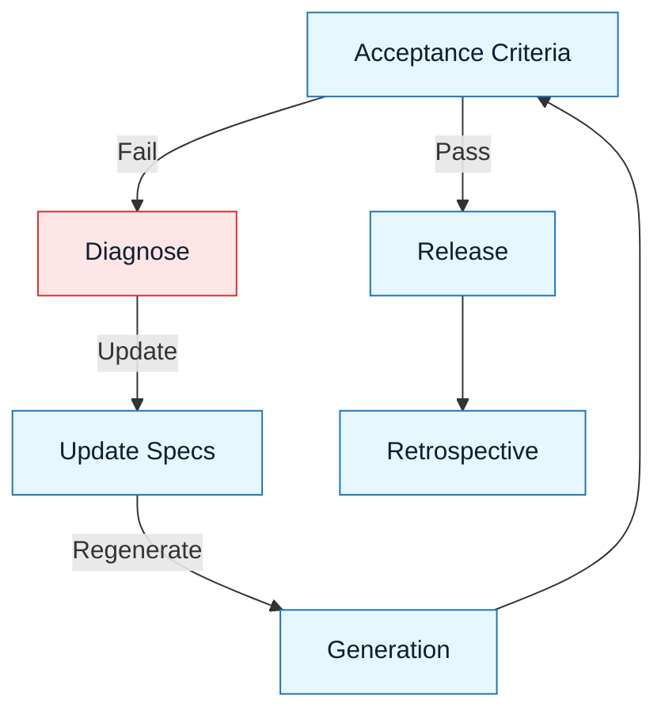

# Iteration and Release

:::info[Purpose]
This step closes the loop. It defines how to handle failure (by fixing the spec, not just the prompt) and how to handle success (by releasing and learning).
:::

## Overview

The NNLP Loop is rarely a straight line. You will hit the **Acceptance** gate and fail.

How you react to failure determines whether you are practicing NNLP or just "chatting with a bot."

- **Amateur reaction**: "No, not like that, try again." (Random walk)
- **Professional reaction**: "The model failed because my Constraint Spec was ambiguous. I will update the spec." (Systematic improvement)

---

## The Iteration Protocol

When acceptance fails:

### 1. Diagnose the Source

- **Logic Gap**: Did I forget to handle an edge case?
- **Language Ambiguity**: Did I use a vague word like "efficient"?
- **Constraint Missing**: Did I forget to forbid a library?

### 2. Update the Artifact

**Do not just re-prompt.** Go back to the markdown file (`intent-spec.md` or `constraint-spec.md`) and fix the error there.

### 3. Regenerate

Feed the _corrected_ spec back to the AI. This ensures the fix is reproducible.

:::tip[The Golden Rule of Iteration]
If you fix the code manually, the spec remains broken. The next time you generate, the bug will return. Fix the spec.
:::

---

## The Release Protocol

When acceptance passes:

### 1. Commit the Artifacts

Commit the specs alongside the code. They are the documentation for _why_ the code looks this way.

### 2. Clean Up

Remove temporary context files or chat logs, but keep the **Discovery Brief** and **Specs**.

### 3. Retrospective

If the loop took 5 tries, ask why. Was the Discovery Brief unclear?

---

## Artifact Versioning

Specs are code. They should be versioned like code.

- **Co-location**: Keep `intent-spec.md` in the same folder as the code it describes, or in a `specs/` folder.
- **Commit History**: Update specs in the _same commit_ as the code changes.
- **Drift Detection**: If code changes but specs don't, you have "Spec Drift".

:::info[Best Practice]
Treat your `docs/` folder as the "source code" for your requirements. Never change code without updating the spec that defines it.
:::

---

## Visual: The Feedback Loop

---

## Common Anti-Patterns

| Anti-Pattern            | Symptom                                          | Correction                                       |
| :---------------------- | :----------------------------------------------- | :----------------------------------------------- |
| **The "Manual Patch"**  | Fixing AI bugs by hand to "save time."           | Update the spec so the AI can fix it.            |
| **The "Prompt Drift"**  | Changing the prompt without updating the spec.   | The spec is the source of truth. Keep it synced. |
| **The "Infinite Loop"** | Regenerating 10 times hoping for a lucky result. | Stop. Your spec is broken. Rewrite it.           |

---

## Next Step

The loop is complete.

To see this applied in the real world, go to:
**`docs/05-professional-scenarios/00-scenarios-index.md`**

---
