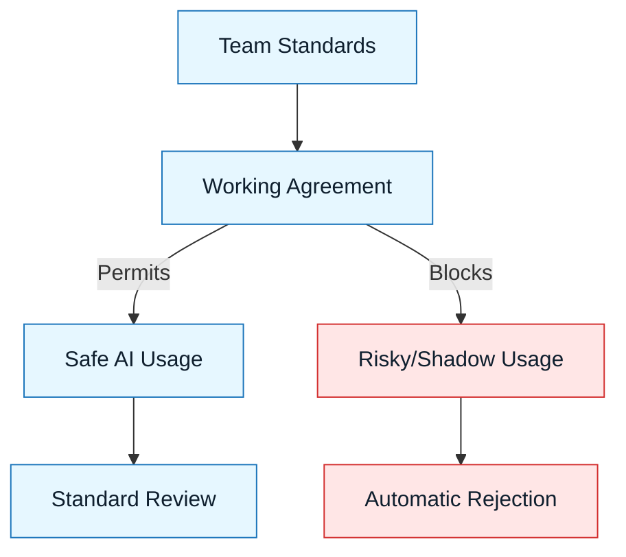

# Working Agreements for Teams

:::info[Purpose]
Working agreements transform AI usage from a "shadow IT" activity into a transparent, managed team practice. They define the social contract for accountability.
:::

## Overview

When individuals use AI, they optimize for personal speed.
When teams use AI, they must optimize for **collective reliability**.

Working Agreements are explicit commitments that team members make to each other about:

- Who owns the code (spoiler: the human).
- Where AI is allowed and forbidden.
- How AI-generated code is reviewed.
- How disagreements between AI suggestions and team standards are resolved.

It is the "Constitution" for your AI-assisted workflow.

---

## Why It Matters

Without explicit agreements, teams drift into dangerous patterns:

- **The "AI did it" defense**: Developers disowning bugs because they didn't write the line.
- **Review fatigue**: Reviewers rubber-stamping massive, AI-generated PRs.
- **Secret usage**: People pasting sensitive data into unapproved tools.
- **Style wars**: AI introducing foreign patterns that degrade codebase consistency.

:::warning[The Reality]
If you don't agree on how to use AI, the most aggressive user sets the standard by default.
:::

---

## Core Components of an Agreement

### 1. The Accountability Clause

The most important rule in NNLP.
_Example: "If you commit it, you own it. 'The model wrote it' is never a valid excuse."_

### 2. The "No-Go" Zones

Areas where AI assistance is strictly prohibited due to risk or complexity.
_Example: "No AI generation for core cryptography modules. No pasting PII into chat."_

### 3. The Disclosure Policy

When to tell the team you used AI.
_Example: "Mark PRs as 'AI-Assisted' if >50% of the logic was generated."_

### 4. The Review Standard

How to review generated code.
_Example: "Reviewers must treat AI code with higher skepticism than human code. If you can't explain it, reject it."_

---

## Visual: The Trust Boundary

The agreement acts as a filter. It ensures that only usage aligned with team values enters the codebase.

---

## Common Anti-Patterns

| Anti-Pattern                    | Symptom                                         | Correction                                                        |
| :------------------------------ | :---------------------------------------------- | :---------------------------------------------------------------- |
| **The "Don't Ask, Don't Tell"** | Secret AI usage leading to weird bugs.          | Make usage transparent and celebrated, provided it follows rules. |
| **The "Rubber Stamp"**          | Approving code because it "looks correct."      | Enforce "explain it to me" reviews.                               |
| **The "Tool Ban"**              | Banning AI entirely (people will just hide it). | Regulate _behavior_, not just tools.                              |

---

## Checklist: Is Your Team Ready?

- [ ] Do we agree that the committer is 100% responsible?
- [ ] Have we defined which files are off-limits?
- [ ] Do we have a standard for reviewing large AI PRs?
- [ ] Is there a safe way to report "I pasted something I shouldn't have"?

---

## Next Step

Formalize these rules using the template:
**`docs/09-templates/working-agreements-template.md`**

---

## Last Reviewed / Last Updated

- Last reviewed: 2025-12-20
- Version: 0.1.0
