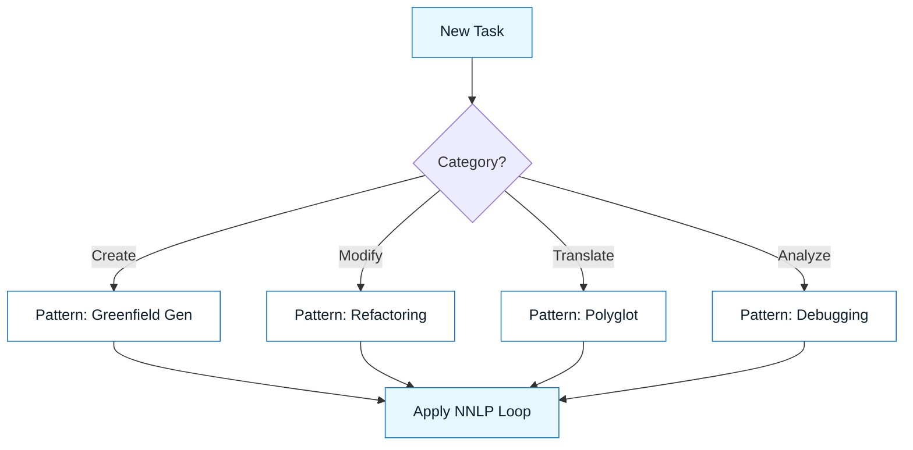

# Execution Patterns

:::info[Purpose]
Patterns are reusable recipes for common AI-assisted tasks. They save you from reinventing the wheel every time you need to write docs, refactor code, or generate tests.
:::

## Overview

NNLP provides the **method** (the 8-step loop).
Execution Patterns provide the **tactics** for specific jobs.

Think of the Loop as the engine, and Patterns as the gears.

Each pattern includes:

- **When to use it**
- **Prerequisites**
- **Step-by-step prompt strategy**
- **Common pitfalls**

---

## Pattern Categories

### 1. Creation (Greenfield)

Generating new code, documentation, or config from scratch.
_Example: "Write a new React component based on this design."_

### 2. Modification (Brownfield)

Refactoring, optimizing, or extending existing code.
_Example: "Refactor this class to use the Repository pattern."_

### 3. Translation

Converting one format to another.
_Example: "Turn this SQL schema into a Pydantic model."_

### 4. Analysis

Debugging, explaining, or auditing code.
_Example: "Find the race condition in this function."_

---

## Visual: Pattern Selection

---

## Available Patterns

| Pattern               | Best For                  | Complexity |
| :-------------------- | :------------------------ | :--------- |
| **The "Clean Slate"** | Writing new modules       | Low        |
| **The "Strangler"**   | Refactoring legacy code   | High       |
| **The "Translator"**  | Porting code/schemas      | Medium     |
| **The "Rubber Duck"** | Debugging and explanation | Low        |
| **The "Doc-Smith"**   | Writing technical docs    | Low        |

:::tip[Start Simple]
If you are new to NNLP, start with **The "Clean Slate"** or **The "Doc-Smith"**. They have the clearest success signals.
:::

---

## Last Reviewed / Last Updated

- Last reviewed: 2025-12-20
- Version: 0.1.0
