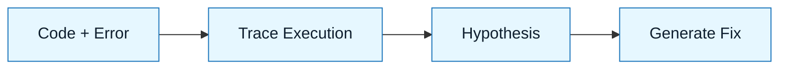

# Pattern: The Rubber Duck

:::info[Value Proposition]
Use this pattern to debug complex logic or understand legacy code. It forces the AI to explain the code's behavior step-by-step, often revealing the bug before you even ask for a fix.
:::

## Overview

"Rubber Ducking" is a classic debugging technique where you explain your code line-by-line to an inanimate object. In NNLP, the AI acts as an **active** rubber duck.

**Goal**: Isolate the root cause of a bug or understand a complex flow.
**Anti-pattern**: "Fix this error." (Result: AI guesses blindly without understanding the state).

---

## When to Use

| ✅ Use This Pattern When...               | 🚫 Do Not Use When...                |
| :---------------------------------------- | :----------------------------------- |
| You have a stack trace but no idea why    | You need to write a new feature      |
| You are reading code you didn't write     | You are doing a large-scale refactor |
| You suspect a race condition or edge case | You know exactly what the fix is     |

---

## Prerequisites

:::warning[Before you start]
Do not paste the error log alone. You must provide the code that caused it.
:::

- **Input**: Source code + Error logs / Observed behavior.
- **Context**: What were you trying to do when it failed?

---

## The Pattern (Step-by-Step)

### Step 1: The Context Dump

Feed the code and the error to the model.

> "Here is `src/payment.ts` and the error log from the last run. Do not fix it yet."

### Step 2: The Walkthrough

Ask the AI to trace the execution path for the specific scenario that failed.

> "Trace the execution flow for a user with an expired card. Explain the state of the `transaction` object at each step."

_Why? This forces the model to build an internal representation of the logic flow._

### Step 3: The Interrogation

Ask specific "What if" questions to test hypotheses.

> "What happens if the API returns a 503 at line 42? Is the `catch` block reachable?"

### Step 4: The Fix

Once the logic gap is exposed, ask for the correction.

> "The error is that we don't check for `null` before accessing `transaction.id`. Generate the fix."

---

## Example Scenario

- **Context**: A React component crashes only on the second render.
- **Input**: Component code + `useEffect` logic.
- **Process**: Asked AI to "Trace the dependency array changes between render 1 and 2."
- **Outcome**: AI identified a stale closure in the event listener.

---

## Common Pitfalls

| Pitfall              | Impact                        | Correction                                                  |
| :------------------- | :---------------------------- | :---------------------------------------------------------- |
| **Premature Fixing** | AI guesses a fix immediately. | Say "Do not fix yet. Explain the bug first."                |
| **Missing Context**  | AI assumes standard behavior. | Explicitly state "This is a legacy system using callbacks." |

:::danger[Critical Risk]
Never paste production logs containing PII (emails, IDs) into a cloud LLM. Scrub them first.
:::

---

## Last Reviewed / Last Updated

- Last reviewed: 2025-12-20
- Version: 0.1.0
