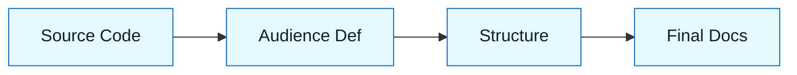

# Pattern: The Doc-Smith

:::info[Value Proposition]
Use this pattern to generate accurate, maintainable documentation from code. It prevents the "docs drift" where documentation lags behind reality.
:::

## Overview

AI is excellent at explaining code, but it tends to be verbose and salesy.

**Goal**: Create concise, technical documentation that matches the code exactly.
**Anti-pattern**: "Write docs for this." (Result: Marketing fluff).

---

## When to Use

| ✅ Use This Pattern When...    | 🚫 Do Not Use When...         |
| :----------------------------- | :---------------------------- |
| Documenting a new API endpoint | Writing a marketing blog post |
| Creating a README for a tool   | Writing a legal disclaimer    |
| Explaining a complex regex     | Documenting unwritten code    |

---

## Prerequisites

:::warning[Before you start]
The code must be stable. Do not document code that is about to change.
:::

- **Input**: The actual source code files.
- **Style Guide**: A brief definition of tone (e.g., "Terse, professional").

---

## The Pattern (Step-by-Step)

### Step 1: Context Injection

Feed the code to the model.

> "Read `src/utils/auth.ts`. Do not summarize it yet."

### Step 2: Define the Audience

Tell the AI who is reading.

> "You are writing for a Senior DevOps Engineer. Assume they know what OAuth is. Do not explain basic concepts."

### Step 3: The Structure First

Ask for the Table of Contents.

> "Propose a structure for the README. It must include: Overview, Configuration, and Troubleshooting."

### Step 4: Generation

> "Write the content. Use code blocks for examples. Keep paragraphs under 3 sentences."

---

## Common Pitfalls

| Pitfall                   | Impact                                 | Correction                                          |
| :------------------------ | :------------------------------------- | :-------------------------------------------------- |
| **Hallucinated Features** | Docs describe features you don't have. | Explicitly say "Only document what is in the code." |
| **Marketing Tone**        | "This amazing tool..."                 | Add constraint: "No hype. No adjectives."           |

:::tip[Pro Tip]
Ask the AI to generate a "Troubleshooting" section based on the error handling logic it sees in the code.
:::
