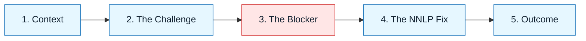

# Professional Scenarios

:::info[The "Game Tape"]
Theory is clean. Reality is messy. These scenarios are "game tapes" of real NNLP execution, showing the messy middle where trade-offs happen.
:::

## Overview

Most AI tutorials show the "Happy Path"—a simple prompt yielding perfect code.
Professional engineering is rarely that simple.

**Professional Scenarios** document end-to-end workflows for complex tasks. They show:

- How to handle ambiguity.
- How to recover when the model hallucinates.
- How to integrate with legacy systems.

They are not just "how-to" guides; they are **"how-we-thought"** guides.

---

## Scenario Categories

### 1. Greenfield (Creation)

Building something new where nothing existed.
_Focus: Architecture, scaffolding, and speed._

### 2. Brownfield (Maintenance)

Refactoring, debugging, or extending legacy code.
_Focus: Safety, constraints, and regression prevention._

### 3. Product & Design

Translating vague ideas into concrete specs.
_Focus: Clarity, user needs, and edge cases._

---

## Visual: The Scenario Arc

Every scenario follows this narrative arc:

We highlight **The Blocker** because that is where the learning happens.

---

## Available Scenarios

| Scenario                                                             | Role         | Difficulty |
| :------------------------------------------------------------------- | :----------- | :--------- |
| [**Refactoring Legacy Auth**](./02-refactoring-legacy-auth.md)       | Backend Eng  | 🔥 High    |
| [**Greenfield React Component**](./01-greenfield-react-component.md) | Frontend Eng | 🟢 Low     |
| [**Writing a PRD**](./03-writing-a-prd.md)                           | Product Mgr  | 🟡 Medium  |
| [**CI/CD Pipeline Migration**](./04-cicd-pipeline-migration.md)      | DevOps       | 🔥 High    |

:::tip[Contribution]
Have a war story? Use the `scenario-template.md` to document your own NNLP win (or interesting failure).
:::

---

## Last Reviewed / Last Updated

- Last reviewed: 2025-12-20
- Version: 0.1.0
