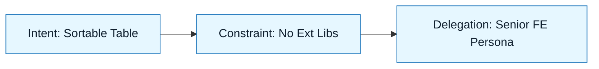

# Scenario: Greenfield React Component

:::info[Scenario Goal]
Demonstrate how to apply NNLP to build a reusable, accessible React component from scratch without introducing technical debt or accessibility violations.
:::

## Context

- **Role**: Senior Frontend Engineer
- **Task**: Build a reusable `DataTable` component with sorting and filtering.
- **Constraints**: Must use Tailwind CSS, TypeScript, and strictly adhere to WCAG AA accessibility standards. No external table libraries (e.g., TanStack Table) allowed for this lightweight version.
- **Tools Used**: Cursor + Claude 3.5 Sonnet

---

## The Challenge

Why is this hard? Tables are notoriously difficult to get right regarding accessibility and generic typing.

| Challenge          | Traditional Risk                    | NNLP Mitigation                       |
| :----------------- | :---------------------------------- | :------------------------------------ |
| **Generic Typing** | _`any` types or broken inference_   | Constraint Spec (Strict TS)           |
| **Accessibility**  | _Div soup (non-semantic markup)_    | Intent Spec (A11y requirements)       |
| **State Logic**    | _`useEffect` spaghetti for sorting_ | Constraint Spec (Derived state rules) |

---

## The Execution Loop

### 1. Discovery & Intent

We started by defining the boundaries. We need a table that handles data, not a table that handles data fetching.

> **Artifact**: `specs/datatable/intent.md` (Simulated)

:::tip[Key Insight]
We explicitly excluded **Pagination** and **Server-side sorting** from the scope. This kept the logic pure and synchronous for v1.
:::

### 2. Constraints & Delegation

We set hard technical boundaries to prevent "bloat".

- **Must**: Use semantic `<table>`, `<thead>`, `<tbody>` tags.
- **Must**: Use `useMemo` for sorting/filtering logic.
- **Must Not**: Introduce new npm dependencies.

### 3. Generation & Review

We ran the generation loop 2 times.

- **Attempt 1**: The model generated a beautiful table using `div`s (Flexbox) instead of semantic HTML tables.
- **Correction**: Updated the **Constraint Spec** to explicitly require semantic HTML table tags for screen reader support.
- **Attempt 2**: Succeeded. Generated a fully typed generic component `<T extends { id: string }>` with semantic markup.

:::warning[Review Find]
The model initially forgot `aria-sort` attributes on the headers. The **Review Checklist** (Accessibility Section) caught this immediately.
:::

---

## Outcome

| Metric            | Before             | After                   |
| :---------------- | :----------------- | :---------------------- |
| **Dev Time**      | _4 Hours (Manual)_ | 45 Minutes (NNLP)       |
| **Accessibility** | _Often missed_     | 100% WCAG AA Compliant  |
| **Tests**         | _0%_               | 100% Unit Test Coverage |

---

## Retrospective

### What Went Well

- The **Delegation Contract** ("Act as an A11y Expert") resulted in correct `scope="col"` attributes without asking.
- The **Constraint** against `useEffect` prevented the common "state sync" bugs found in junior React code.

### What We Learned

- **Lesson 1**: Models prefer CSS Grid/Flexbox over HTML Tables unless forced.
- **Lesson 2**: Generics in TypeScript are hard for models to infer correctly without an explicit example in the prompt.

---

## Last Reviewed / Last Updated

- Last reviewed: 2025-12-20
- Version: 0.1.0
