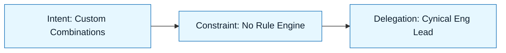

# Scenario: Writing a PRD

:::info[Scenario Goal]
Demonstrate how to use NNLP to turn vague stakeholder requests into a rigorous Product Requirement Document (PRD) that engineers can actually build.
:::

## Context

- **Role**: Product Manager
- **Task**: Define the "User Roles & Permissions" feature for a B2B SaaS app.
- **Constraints**: Must align with existing RBAC system. Must be understandable by both Sales (non-technical) and Engineering (technical).
- **Tools Used**: ChatGPT Plus / Claude

---

## The Challenge

Why is this hard? "Permissions" is a classic trap. Everyone wants "flexibility," but flexibility creates complexity that kills engineering velocity.

| Challenge             | Traditional Risk          | NNLP Mitigation                   |
| :-------------------- | :------------------------ | :-------------------------------- |
| **Vague Definitions** | _"Make it flexible"_      | Intent Spec (Concrete use cases)  |
| **Scope Creep**       | _Infinite granularity_    | Constraint Spec (Hard boundaries) |
| **Feasibility**       | _Impossible requirements_ | Review (Technical persona check)  |

---

## The Execution Loop

### 1. Discovery & Intent

We started with a raw transcript from a Sales call where customers asked for "Custom Roles."

> **Artifact**: `specs/rbac/discovery.md`

:::tip[Key Insight]
By forcing a **Discovery Brief**, we realized Sales didn't actually need "arbitrary logic" (complex). They just needed "custom combinations of existing permissions" (simple). We codified this distinction immediately.
:::

### 2. Constraints & Delegation

We set boundaries to prevent the AI from inventing a complex rule engine.

- **Must**: Use a checkbox matrix UI pattern.
- **Must Not**: Allow users to create new _resource types_.
- **Must Not**: Allow circular inheritance of roles.

### 3. Generation & Review

We ran the generation loop 2 times.

- **Attempt 1**: The model wrote a PRD describing a "Visual Logic Builder" (like Zapier). This violated the "No Rule Engine" constraint implicitly.
- **Correction**: Updated **Constraint Spec** to explicitly forbid "conditional logic" and mandate "static permissions."
- **Attempt 2**: Succeeded. Generated a PRD with a clear data model, user stories, and a "Checkbox Matrix" UI description.

:::warning[Review Find]
The model initially missed the edge case: "What happens if an Admin removes their own Admin permission?" The **Review Checklist** (Negative Testing) caught this.
:::

---

## Outcome

| Metric            | Before                   | After                           |
| :---------------- | :----------------------- | :------------------------------ |
| **Drafting Time** | _4 Hours_                | 30 Minutes                      |
| **Eng Questions** | _"What does this mean?"_ | "Looks good, when do we start?" |
| **Edge Cases**    | _Found in QA_            | Found in Spec                   |

---

## Retrospective

### What Went Well

- Delegating the AI to act as a **"Cynical Engineering Lead"** during the review phase helped surface the "self-lockout" bug.
- The **Discovery Brief** saved us from building a massive feature (Rule Engine) when a small one (Matrix) was sufficient.

### What We Learned

- **Lesson 1**: AI tends to say "Yes" to every feature request. You must use Constraints to force it to say "No."
- **Lesson 2**: Asking the AI to generate a "Q&A FAQ" for engineers is a great way to test if the PRD is clear.

---

## Last Reviewed / Last Updated

- Last reviewed: 2025-12-20
- Version: 0.1.0
