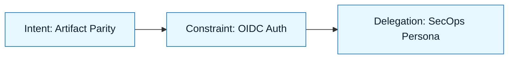

# Scenario: CI/CD Pipeline Migration

:::info[Scenario Goal]
Demonstrate how to migrate a complex, legacy CI/CD pipeline to a modern platform with zero downtime and verified artifact parity.
:::

## Context

- **Role**: DevOps Engineer
- **Task**: Migrate a legacy Jenkins pipeline (Groovy) to GitHub Actions (YAML) for a Java/Maven service.
- **Constraints**: Must produce bit-for-bit identical artifacts (checksum parity). Must use OIDC for AWS authentication (no long-lived keys). No changes to application code allowed.
- **Tools Used**: Cursor + Claude 3.5 Sonnet

---

## The Challenge

Why is this hard? CI/CD pipelines are the "nervous system" of engineering. If they break, nobody ships. Legacy pipelines often rely on hidden plugin behavior.

| Challenge         | Traditional Risk                   | NNLP Mitigation                             |
| :---------------- | :--------------------------------- | :------------------------------------------ |
| **Hidden Logic**  | _Plugin magic vs Explicit YAML_    | Discovery Brief (Plugin Audit)              |
| **Secret Sprawl** | _Hardcoded creds in UI_            | Constraint Spec (OIDC Mandate)              |
| **Parity**        | _"It builds but fails at runtime"_ | Acceptance Criteria (Checksum verification) |

---

## The Execution Loop

### 1. Discovery & Intent

We started by auditing the `Jenkinsfile` and the Jenkins UI configuration to map every hidden environment variable.

> **Artifact**: `specs/pipeline-migration/discovery.md`

:::tip[Key Insight]
We found that the legacy pipeline implicitly injected a `settings.xml` for Maven from a global config. We had to make this explicit in the **Intent Spec** or the build would fail authentication.
:::

### 2. Constraints & Delegation

We set strict security and operational boundaries.

- **Must**: Use `aws-actions/configure-aws-credentials` with OIDC.
- **Must Not**: Store long-lived AWS Access Keys in GitHub Secrets.
- **Must**: Cache Maven dependencies to match Jenkins build times.

### 3. Generation & Review

We ran the generation loop 3 times.

- **Attempt 1**: The model generated a valid workflow but used `mvn clean package`.
- **Correction**: Updated **Constraint Spec** to require `mvn -B package --file pom.xml` to match the specific batch mode flags used in Jenkins.
- **Attempt 2**: The model tried to use a third-party action for caching that wasn't on our allow-list.
- **Correction**: The **Delegation Contract** explicitly forbade non-official actions. We pointed the model to `actions/cache`.
- **Attempt 3**: Succeeded.

:::warning[Review Find]
The model hardcoded `us-east-1` in the deploy step. The **Review Checklist** (Systems Check) caught this, as we deploy to multiple regions.
:::

---

## Outcome

| Metric          | Before                 | After                   |
| :-------------- | :--------------------- | :---------------------- |
| **Visibility**  | _Hidden in Jenkins UI_ | Versioned YAML in Repo  |
| **Security**    | _Static Access Keys_   | Short-lived OIDC Tokens |
| **Maintenance** | _"Don't touch it"_     | Standard GHA Components |

---

## Retrospective

### What Went Well

- The **Discovery Brief** forced us to find the "hidden" Maven settings before we wasted hours debugging auth failures.
- The **Acceptance Criteria** (Checksum Parity) gave us confidence to switch traffic immediately.

### What We Learned

- **Lesson 1**: LLMs are great at writing YAML, but bad at guessing context (like private artifact repo URLs). You must inject these in the **Constraint Spec**.
- **Lesson 2**: "Migration" is a translation task. Providing the source `Jenkinsfile` in the **Generation Request** context is critical.

---

## Last Reviewed / Last Updated

- Last reviewed: 2025-12-20
- Version: 0.1.0
