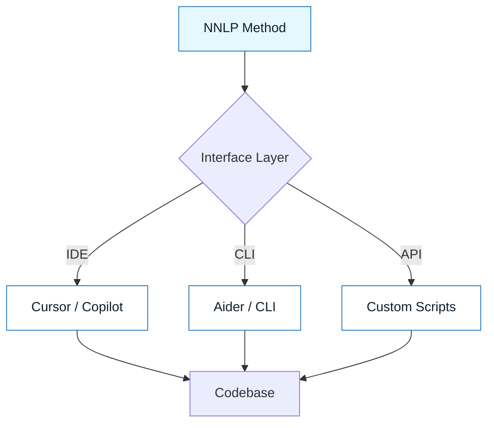

# Frameworks and Tooling

:::info[The Philosophy]
The tool is not the method. A carpenter can use a hand saw or a power saw, but the geometry of the cut remains the same. NNLP works with any tool that allows context injection.
:::

## Overview

NNLP is **tool-agnostic**.

You can execute the NNLP Loop using:

- A $20/mo IDE subscription (Cursor, Copilot)
- A free CLI tool (Aider, Claude Code)
- A local model running on your GPU (Ollama)
- A raw API script

The artifacts (Specs, Contracts) remain the same. The tool is just the execution engine.

---

## Tool Categories

### 1. IDE-Integrated (The "Co-Pilot")

Tools that live inside your editor.
_Best for: Micro-refactoring, line completion, and small loop iterations._
_Examples: GitHub Copilot, Cursor, JetBrains AI._

### 2. CLI Agents (The "Engineer")

Tools that run in the terminal and can edit multiple files autonomously.
_Best for: Large refactors, migrations, and "set and forget" tasks._
_Examples: Aider, Claude Code, Mentat._

### 3. Local Inference (The "Sandbox")

Running models on your own hardware for privacy or cost.
_Best for: Red Zone data, offline work._
_Examples: Ollama, LM Studio, LocalAI._

---

## Visual: The Abstraction Layer

---

## What Makes a Tool "NNLP-Ready"?

Not all AI tools are suitable for professional NNLP. To execute the loop effectively, a tool must support:

1. **Context Injection**: You must be able to explicitly add `intent-spec.md` and `constraint-spec.md` to the context window.
2. **Diff Review**: It must show you exactly what changed before you commit.
3. **File Access**: It needs read/write access to your repository (copy-pasting is too slow for the full loop).

:::warning[Tool Trap]
Avoid tools that hide the prompt or the context. If you can't see what the model sees, you can't debug the output.
:::

---

## Last Reviewed / Last Updated

- Last reviewed: 2025-12-20
- Version: 0.1.0
