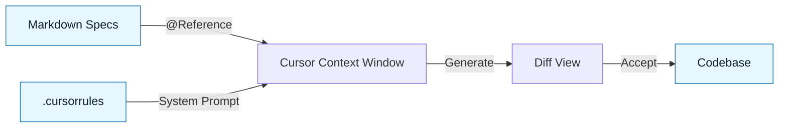

# IDE Setup: Cursor

:::info[Why Cursor?]
Cursor is currently the preferred IDE for NNLP because it treats **Context Injection** as a first-class feature. You can explicitly reference your specs using `@Symbols`, making the NNLP Loop frictionless.
:::

## Overview

In standard VS Code + Copilot, pasting specs into the chat is manual and tedious.
In Cursor, you can reference files dynamically. This ensures the model always sees the _current_ version of your **Intent** and **Constraints**.

---

## Configuration for NNLP

### 1. The `.cursorrules` File

Cursor reads a `.cursorrules` file in your project root to set the system prompt.
Use this to enforce the **Delegation Contract** globally.

**Create `.cursorrules`:**

```markdown
You are a Senior Engineer practicing NNLP (Nuanced Natural Language Programming).

BEHAVIOR:

- Do not generate code until you have read the relevant specs provided in context.
- If a Constraint Spec is present, you must strictly adhere to it.
- If an Intent Spec is ambiguous, ask clarifying questions before generating.

OUTPUT:

- Be terse.
- Do not explain code unless asked.
- Always include type definitions.
```

### 2. The "Composer" Feature (Cmd+I)

Use Composer for **Step 5: Generation**. It allows the model to edit multiple files simultaneously, which is essential when a single Intent Spec touches the DB, API, and Frontend.

---

## The NNLP Workflow in Cursor

### Step 1: Load Context

Instead of pasting text, type `@` to reference your artifacts.

**Prompt:**

> "I am working on the Auth Refactor. Here is the context: @intent-spec.md @constraint-spec.md"

### Step 2: Execute Generation

**Prompt:**

> "Based on the specs above, implement the `AuthService` class. @delegation-contract.md applies."

### Step 3: Review Diff

Cursor shows a diff view (Green/Red) before applying changes.
**Do not click "Accept All" blindly.** Use this view for **Step 6: Review & Interrogation**.

---

## Visual: Context Flow



---

## Pro Tips

- **Pinning**: You can "pin" your `constraint-spec.md` in the chat so it stays in context for the entire session.
- **Docs**: Use `@Docs` to index external library documentation (e.g., "Add @Tailwind Docs to context") to prevent hallucinations about syntax.

---

## Last Reviewed / Last Updated

- Last reviewed: 2025-12-20
- Version: 0.1.0
