# Data Boundaries

:::info[Purpose]
To prevent data leaks, we classify data into three zones. These zones dictate which AI tools can be used and what context can be provided.
:::

## Overview

Not all data is equal. Sending public documentation to an LLM is safe; sending customer PII is a firing offense.

We use a **Traffic Light Protocol** to make these decisions simple and binary.

---

## The Three Data Zones

### 🟢 Green Zone (Public / Non-Sensitive)

**Definition**: Data that is already public or would cause no harm if leaked.

- **Examples**: Open source code, public documentation, generic boilerplate, marketing copy (post-release).
- **Approved Tools**: Any approved LLM (ChatGPT, Claude, GitHub Copilot).
- **Policy**: Go fast. No special redaction needed.

### 🟡 Yellow Zone (Internal / Proprietary)

**Definition**: Business logic, internal strategy, or code that is proprietary but contains no secrets or PII.

- **Examples**: Application source code, internal memos, architectural diagrams.
- **Approved Tools**: Enterprise-grade tools with **Zero-Retention** agreements (e.g., Copilot Business, Cursor Privacy Mode).
- **Policy**: **Do not use free/personal tier models.** They may train on your data.

### 🔴 Red Zone (Restricted / Toxic)

**Definition**: Data that triggers legal, compliance, or severe security incidents if leaked.

- **Examples**: Customer PII (names, emails), API keys, database credentials, passwords, financial records.
- **Approved Tools**: **NONE** (unless running on a fully air-gapped local LLM).
- **Policy**: **Strictly Prohibited.** You must scrub this data before it touches any prompt.

---

## Visual: Data Flow Decision Tree

```mermaid
flowchart TD
    Start[Data to Process] --> Check{Is it Red Zone?}

    Check -->|Yes| Stop[🛑 STOP]
    Stop --> Local[Use Local LLM or Scrub Data]

    Check -->|No| CheckYellow{Is it Yellow Zone?}

    CheckYellow -->|Yes| Enterprise[🏢 Use Enterprise/Zero-Retention Tools]
    CheckYellow -->|No| Public[🌍 Use Any Approved Tool]

    classDef stop fill:#FFE6E6,stroke:#D32F2F,color:#0F1F2E;
    classDef safe fill:#E6F7FF,stroke:#1B75BB,color:#0F1F2E;
    class Stop stop;
    class Enterprise,Public safe;
```

---

## Common Violations to Watch For

| Violation          | Risk                                   | Correction                                      |
| :----------------- | :------------------------------------- | :---------------------------------------------- |
| **Pasting Logs**   | Logs often contain User IDs or emails. | Scrub PII before pasting.                       |
| **Config Files**   | `.env` files often contain keys.       | Never paste `.env` files. Paste `.env.example`. |
| **Database Dumps** | Real production data.                  | Use synthetic/mock data for SQL generation.     |

:::danger[The Golden Rule]
If you are unsure if data is Red or Yellow, treat it as **Red**.
:::

---

## Checklist Before Prompting

- [ ] Have I removed all API keys and secrets?
- [ ] Have I replaced real customer names with "John Doe"?
- [ ] Am I using the Enterprise version of the tool?

---

## Last Reviewed / Last Updated

- Last reviewed: 2025-12-20
- Version: 0.1.0
