# Guardrails and Governance

:::info[The Core Philosophy]
Governance is not about slowing down. It is about installing brakes so you can drive faster without crashing.
:::

## Overview

In NNLP, we do not treat AI as a magic box. We treat it as a **junior employee with infinite speed and zero judgment**.

To work safely with such an entity, you need explicit guardrails.
This section defines the policies, boundaries, and checks that allow teams to adopt GenAI at scale without exposing the organization to unacceptable risk.

---

## The Three Pillars of AI Governance

### 1. Data Boundaries

**Where does the data go?**
Defining what information can leave your local environment, what can be sent to an LLM provider, and what must never leave the secure enclave.

### 2. Threat Modeling

**How can this go wrong?**
A lightweight process to anticipate specific AI failure modes (hallucination, injection, bias) before they reach production.

### 3. Accountability

**Who owns the outcome?**
The "Human-in-the-Loop" principle. Ensuring that every AI-generated artifact has a human owner who is responsible for its behavior.

---

## Visual: The Safety Wrapper

```mermaid
flowchart TD
    subgraph Governance ["🛡️ Governance Layer"]
        Data[Data Boundaries]
        Threat[Threat Model]
        Owner[Accountability]
    end

    subgraph Execution ["⚙️ NNLP Loop"]
        Gen[Generation]
        Rev[Review]
    end

    Data --> Gen
    Threat --> Rev
    Owner --> Rev

    classDef layer fill:#F0F5FF,stroke:#1B75BB,color:#0F1F2E;
    classDef step fill:#ffffff,stroke:#1B75BB,color:#0F1F2E;
    class Governance layer;
    class Execution,Gen,Rev step;
```

Governance wraps the execution loop. It filters inputs (Data) and validates outputs (Threat/Accountability).

---

## Key Documents in This Section

| Document                 | Purpose                                     |
| :----------------------- | :------------------------------------------ |
| **Data Boundaries**      | Defines "Red/Yellow/Green" data zones.      |
| **Threat Model Lite**    | A 5-minute risk assessment for AI features. |
| **Accountability Model** | Roles and responsibilities for AI adoption. |

:::warning[Start Here]
If you are a team lead, start by defining your **Data Boundaries**. Without that, no other work is safe.
:::

---

## Next Step

Learn how to assess risk quickly:
**`threat-model-lite.md`**

---

## Last Reviewed / Last Updated

- Last reviewed: 2025-12-20
- Version: 0.1.0
