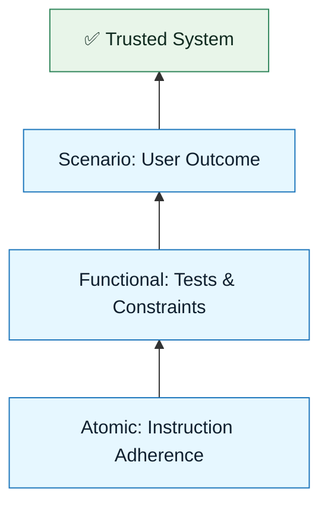

# Evaluation Overview

:::info[The Reality Check]
AI is probabilistic. Your standards must be deterministic. Evaluation is the process of measuring the gap between the two.
:::

## Overview

In traditional software, tests pass or fail.
In AI-assisted software, outputs can be "mostly right," "subtly wrong," or "plausibly hallucinated."

**Evaluation** is the discipline of quantifying these fuzzy states into actionable data.

It answers:

- Is this safe to ship?
- Is the quality improving or degrading over time?
- Are our constraints tight enough?

---

## The Three Levels of Evaluation

We evaluate NNLP artifacts at three altitudes:

### 1. Atomic Level (The Prompt)

Did the model follow the specific instruction in the Generation Request?
_Metric: Instruction Adherence._

### 2. Functional Level (The Code)

Does the generated code compile, run, and pass unit tests?
_Metric: Pass/Fail Rate._

### 3. Scenario Level (The Outcome)

Did the solution actually solve the problem defined in the Discovery Brief without side effects?
_Metric: Success Rate & Side Effect Rate._

---

## Visual: The Evaluation Pyramid

---

## Moving Beyond "Vibes"

The biggest risk in AI adoption is **"Vibes-Based Evaluation"**—looking at an output and saying, "Yeah, looks good."

NNLP replaces vibes with **Rubrics** and **Scorecards**.

| Vibes (Bad)                | Rubrics (Good)                                                        |
| :------------------------- | :-------------------------------------------------------------------- |
| "It looks clean."          | "It follows the Repository Pattern defined in the Constraint Spec."   |
| "It seems to work."        | "It passes all 3 negative test cases defined in Acceptance Criteria." |
| "It's better than before." | "It meets the 90% correctness threshold."                             |

---

## Next Step

Define your standards:
**`01-quality-rubric.md`**

---

## Last Reviewed / Last Updated

- Last reviewed: 2025-12-20
- Version: 0.1.0
