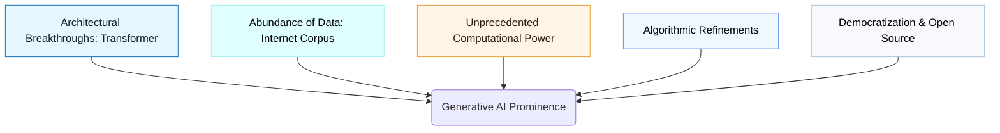

# Why Generative AI is so Prominent Now

While the underlying concepts of generative models have existed for decades, Generative AI's recent surge into mainstream consciousness and its unprecedented capabilities are a result of a perfect storm of technological advancements converging over the last decade. It's not a single breakthrough, but a synergistic combination of factors that have unlocked its true potential.

## 1. Architectural Breakthroughs: The Transformer

The most pivotal breakthrough was the introduction of the [Transformer Architecture](../05-attention-and-transformers/transformer-model-architecture.md) in 2017.

*   **Parallelization**: Unlike previous Recurrent Neural Networks (RNNs) that processed sequences word by word, the Transformer's self-attention mechanism allowed for parallel processing of entire sequences. This drastically reduced training times.
*   **Long-Range Dependencies**: Transformers effectively capture dependencies between distant words in a sequence, overcoming the "short-term memory" limitations of RNNs.
*   **Scalability**: The architecture proved highly scalable, allowing models to grow exponentially in size (number of parameters).

## 2. Abundance of Data: The Internet as a Corpus

Generative AI models, especially Large Language Models (LLMs), thrive on data. The vast, diverse, and readily available text (and other modalities) on the internet provides an unprecedented training corpus.

*   **Massive Datasets**: Models are trained on petabytes of text data (e.g., Common Crawl, Wikipedia, books, GitHub code). This exposure to diverse linguistic patterns, facts, and styles is crucial for their generalization abilities.
*   **Self-Supervised Learning**: The availability of unlabeled data is key. Models learn by predicting masked words or next words, extracting patterns without requiring expensive human annotations for every piece of data.

## 3. Unprecedented Computational Power

Training these massive models requires immense computational resources, which have become more accessible and powerful.

*   **GPU Advancements**: Graphics Processing Units (GPUs) are highly efficient at parallel computations required for neural networks. Continuous advancements in GPU technology (e.g., NVIDIA's CUDA, Google's TPUs) have made training feasible.
*   **Distributed Computing**: The ability to distribute model training across thousands of GPUs and specialized hardware has allowed for the scaling required for truly "large" models.
*   **Cloud Infrastructure**: Cloud providers offer on-demand access to these resources, democratizing access to high-performance computing.

## 4. Algorithmic Refinements and Optimization

Beyond the core architecture, continuous improvements in optimization techniques have played a vital role.

*   **Training Stability**: Techniques like Layer Normalization, Residual Connections, and improved initialization methods.
*   **Optimization Algorithms**: Adam, Adafactor, and learning rate schedulers ensure efficient and stable convergence during training.
*   **Regularization**: Dropout, weight decay to prevent overfitting.

## 5. Democratization and Open Source Movement

The accessibility of models, tools, and research has accelerated progress.

*   **Pre-trained Models**: Open-sourcing of models like BERT, GPT-2, Llama, and frameworks like Hugging Face Transformers has lowered the barrier to entry, allowing researchers and developers to build upon state-of-the-art models without starting from scratch.
*   **Research Momentum**: A vibrant global research community constantly pushes the boundaries, sharing new techniques and findings.

## Actionable Insight: Leverage Pre-trained Models

The prominence of GenAI underscores the power of transfer learning. For most applications, training a model from scratch is unnecessary and impractical. Instead, **leverage existing pre-trained Large Language Models** and fine-tune them for your specific tasks. This drastically reduces computational cost, data requirements, and development time.

## Visual Suggestion: Confluence of Factors Diagram

## Next Steps

To ground our understanding of AI, we'll differentiate between various forms of intelligence in **[ANI vs. AGI](./ani-vs-agi.md)**.
---
