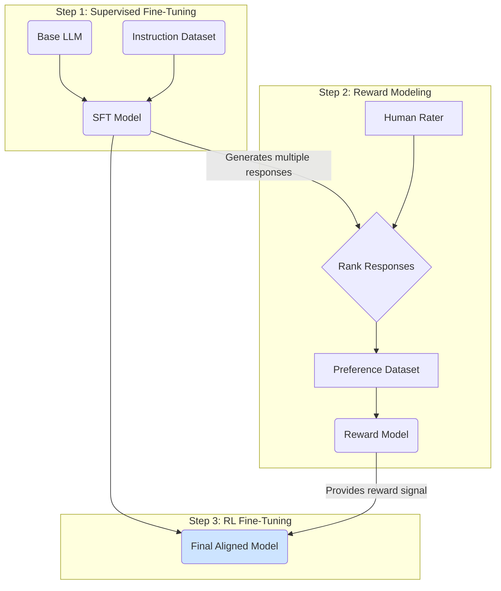

# LLM Alignment and RLHF

A raw, pre-trained Large Language Model is a powerful predictor of text, but it is not necessarily a helpful or safe assistant. The process of making an LLM's goals and behaviors align with human values and intentions is known as **alignment**.

The primary technique used to achieve alignment in modern LLMs is **Reinforcement Learning from Human Feedback (RLHF)**.

This builds upon the initial stages of [LLM training](./training-and-datasets.md) and is a key practice for [Responsible AI](/docs/05-responsible-ai).

## The Alignment Problem

A base model trained to predict the next token might:
-   Generate unhelpful or irrelevant responses.
-   Produce biased, unsafe, or unethical content it has learned from its training data.
-   "Hallucinate" facts without any sense of their veracity.
-   Fail to follow complex instructions.

The goal of alignment is to steer the model towards being **Helpful, Honest, and Harmless (HHH)**.

## Reinforcement Learning from Human Feedback (RLHF)

RLHF is a multi-step process that uses human preferences as a signal to fine-tune the model's behavior.

### Step 1: Supervised Fine-Tuning (SFT)

First, a pre-trained base model is instruction-tuned on a smaller, high-quality dataset of instruction-response pairs. These examples are often written by human labelers to demonstrate the desired output style and format. While this makes the model better at following instructions, it's not enough to achieve deep alignment on its own.

### Step 2: Training a Reward Model

This is the core of the "human feedback" loop.
1.  **Generate Responses:** For a given prompt, the SFT model generates several different responses.
2.  **Human Ranking:** Human labelers are presented with these responses and rank them from best to worst based on a set of criteria (e.g., helpfulness, accuracy, safety).
3.  **Train the Reward Model:** A separate language model, called the **reward model**, is trained on this ranking data. Its job is to predict which response a human would prefer. It learns to assign a higher scalar "reward" score to responses that are more aligned with human preferences.

### Step 3: Fine-Tuning with Reinforcement Learning

The SFT model is now fine-tuned further using a reinforcement learning algorithm (commonly Proximal Policy Optimization, or PPO).
1.  **Generate a Response:** The model receives a prompt and generates a response.
2.  **Calculate a Reward:** The response is passed to the **reward model**, which calculates a reward score for it.
3.  **Update the Model:** The reward signal is used to update the parameters of the LLM. This process encourages the LLM to generate responses that will receive a higher reward from the reward model.

Essentially, the LLM is trained to "please" the reward model, which itself is a proxy for human preferences. This entire loop can be repeated to continuously refine the model's alignment.

:::tip[The Future of Alignment: Beyond RLHF]
While RLHF is currently the dominant paradigm, it has limitations (e.g., it can be expensive and the quality depends on the human labelers). Researchers are actively exploring other methods:

-   **Direct Preference Optimization (DPO):** A newer technique that simplifies the process by using the preference data to directly fine-tune the LLM, bypassing the need to train a separate reward model.
-   **Constitutional AI:** A method where the AI is given a set of principles or a "constitution" and trained to align its own responses with those principles, reducing the reliance on direct human feedback for every aspect of behavior.
:::

## Next Steps

Alignment is the technical process of making a model safer. To see how this process fits into a broader safety strategy, explore these topics:

- **[Bias Detection and Mitigation](../../05-responsible-ai/bias-detection-and-mitigation.md):** Learn how alignment helps mitigate, but does not eliminate, model bias.
- **[Red Teaming Guide](../../05-responsible-ai/red-teaming-guide.md):** Discover how to proactively find the alignment failures that remain in your model.
