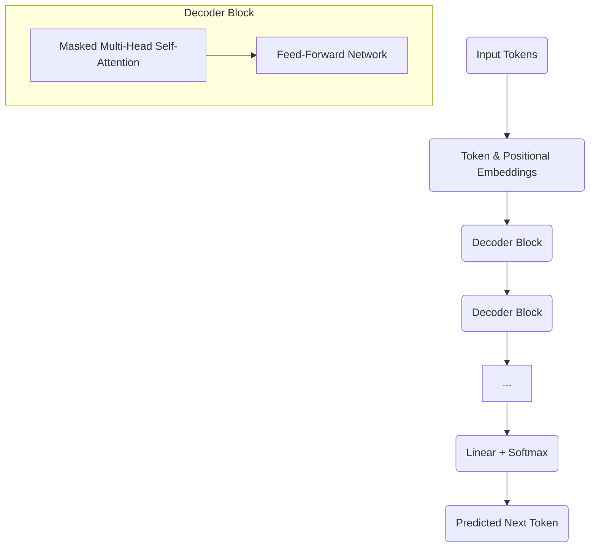

# GPT: Decoder-only Models

The **GPT (Generative Pre-trained Transformer)** series, developed by OpenAI, represents a pivotal advancement in the field of Large Language Models (LLMs). These models are prime examples of the **decoder-only** architecture, a specialized configuration of the [Transformer Architecture (for LLMs)](./transformer-architecture.md) that is inherently designed for generative tasks, particularly producing coherent and contextually relevant text.

## The Decoder-Only Architecture: Designed for Generation

Unlike models like BERT, which utilize the Transformer's encoder stack for understanding (discriminative tasks), GPT models exclusively employ the Transformer's **decoder stack**. This architectural choice is perfectly suited for autoregressive language modeling, where the goal is to predict the next token in a sequence given all preceding tokens.

### Key Characteristics of a Decoder-Only Transformer

1.  **Masked Self-Attention**: This is the defining feature. Each token in the decoder can only attend to the tokens that come *before* it in the input sequence. This masking ensures that the model cannot "cheat" by seeing future words when it's trying to predict the current one.
2.  **No Encoder-Decoder Attention**: Since there's no separate encoder input, there's no cross-attention mechanism between encoder and decoder outputs. The model's entire context comes from its own input (the prompt and the tokens it has already generated).
3.  **Autoregressive Generation**: GPT models generate text token by token. Once a token is predicted, it is added to the input sequence, and the model then predicts the next token based on the updated sequence. This process continues until an end-of-sequence token is generated or a maximum length is reached.

### Visual Suggestion: GPT Decoder Stack

## How GPT Generates Text

The generative process in GPT is a direct consequence of its pre-training objective: predicting the next word in a sequence.

1.  **Prompt Input**: The user provides an initial text prompt.
2.  **Tokenization & Embedding**: The prompt is tokenized into sub-word units and converted into numerical embeddings (with positional encodings).
3.  **Forward Pass**: These embeddings are fed through the stack of Transformer decoder blocks.
4.  **Probability Distribution**: The final layer outputs a probability distribution over the entire vocabulary for what the *next* token should be.
5.  **Sampling**: A token is selected from this distribution (e.g., using [Temperature](./temperature.md) or [Top-k/Top-p Sampling](./parameter-top-k-vs-top-p-sampling.md)).
6.  **Loop**: The selected token is appended to the input sequence, and steps 3-5 are repeated until the generation is complete.

## Actionable Insight: Prompt Engineering is Key

For decoder-only models like GPT, the input prompt is the *sole source of context* (beyond the model's pre-trained weights). Therefore, **effective prompt engineering** is paramount:

*   **Be Explicit**: Clearly define the task, tone, format, and any constraints.
*   **Provide Examples**: Few-shot examples embedded in the prompt significantly guide the model's behavior.
*   **Set the Scene**: Give the model enough context to understand the domain and desired output.

## Evolution of GPT Models

The GPT series has evolved through several iterations, primarily distinguished by their scale (number of parameters) and the size/diversity of their training data:

*   **GPT-1 (2018)**: First to demonstrate the power of generative pre-training with a Transformer decoder.
*   **GPT-2 (2019)**: Demonstrated impressive text generation quality and zero-shot capabilities.
*   **GPT-3 (2020)**: Massive scale (175 billion parameters), showcased strong few-shot learning abilities.
*   **GPT-3.5 / ChatGPT (2022)**: Fine-tuned with Reinforcement Learning from Human Feedback (RLHF), significantly improving conversational abilities.
*   **GPT-4 (2023)**: Multimodal, even more capable, with improved reasoning and instruction-following.

## Relevance to Generative AI and LLMs

GPT models have been instrumental in popularizing Generative AI and showcasing the immense potential of LLMs. Their ability to generate human-quality text has opened up new applications across creative writing, customer service, education, and software development. The decoder-only architecture's efficiency in text generation makes it a leading choice for building conversational AI, content creation tools, and creative assistants.

## Next Steps

To grasp the full landscape of available LLMs, explore the **[List of Foundation Models](./list-of-foundation-models.md)**.
---
