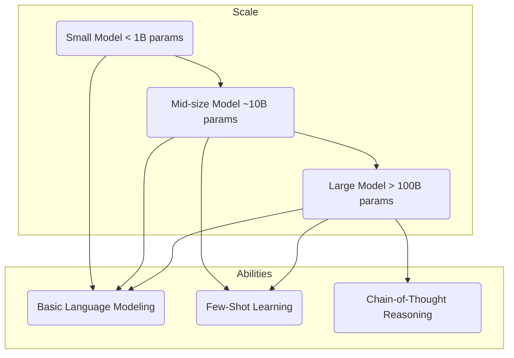

# Introduction to Large Language Models (LLMs)

Building on the foundation of the Transformer architecture, Large Language Models (LLMs) have emerged as a dominant force in artificial intelligence. These models are, at their core, scaled-up versions of the Transformer, trained on immense datasets of text and code.

## What Makes a Language Model "Large"?

The "large" in LLM refers to two primary aspects:

1.  **Number of Parameters:** Parameters are the internal variables that the model learns during training. They represent the knowledge the model has extracted from the data. Modern LLMs have billions, or even trillions, of parameters. This massive number allows them to capture incredibly complex patterns in language.
2.  **Size of Training Data:** LLMs are trained on vast and diverse datasets, often encompassing a significant portion of the public internet (like Common Crawl), books (like Google Books), and code repositories (like GitHub).

:::note[What are "parameters?"]
You can think of parameters as the "knobs" and "dials" inside the model's brain. During training, the model tunes these millions or billions of knobs until it gets good at predicting the next word. The final configuration of these knobs is what represents the model's "knowledge."
:::

## Key Characteristics of LLMs

The massive scale of LLMs leads to several key characteristics that differentiate them from previous NLP models.

### Emergent Abilities

One of the most fascinating aspects of LLMs is the concept of **emergent abilities**. These are capabilities that are not explicitly designed or trained for but appear spontaneously as the model size increases.

Examples of emergent abilities include:

-   **Few-Shot and Zero-Shot Learning:** The ability to perform a task with only a few examples (few-shot) or even just a description of the task (zero-shot), without any specific training.
-   **Chain-of-Thought Reasoning:** The ability to solve multi-step problems by "thinking out loud" and generating intermediate reasoning steps.
-   **Instruction Following:** The ability to follow complex natural language instructions to perform a wide variety of tasks.

These abilities are not typically seen in smaller models but emerge as the parameter count and training data cross certain thresholds.

### Generalization

LLMs are not specialists. Because they are trained on such a wide array of data, they can perform a vast range of tasks without needing to be retrained:

-   Writing and debugging code
-   Translating languages
-   Answering questions
-   Summarizing documents
-   Creative writing

## Next Steps

This section will dive deeper into the architecture, training processes, and capabilities that make LLMs so powerful.

- **[LLM Training and Datasets](./training-and-datasets.md):** Learn how these massive models are trained.
- **[LLM Model Architectures](./model-architectures.md):** Explore the different types of LLM architectures.
- **[LLM Scaling Laws](./scaling-laws.md):** Understand the relationship between size, data, and performance.
- **[LLM Alignment and RLHF](./alignment-and-rlhf.md):** Discover how models are made safe and helpful.
