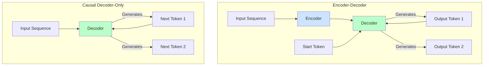

# LLM Model Architectures

While most modern Large Language Models are based on the Transformer, there are several high-level architectural variations that are optimized for different types of tasks. The three most common architectures are:

1.  **Encoder-Decoder**
2.  **Causal Decoder-Only**
3.  **Prefix-LM (or Non-Causal Decoder-Only)**

Understanding these architectures is key to selecting the right model for your use case. For a refresher on the underlying technology, see the [introduction to the Transformer architecture](../05-attention-and-transformers/introduction-to-attention.md).

## 1. Encoder-Decoder Models

This is the original architecture introduced in the "Attention Is All You Need" paper. It consists of two main parts:

-   **The Encoder:** It processes the entire input sequence and creates a rich numerical representation of it. The attention mechanism in the encoder is **bi-directional**, meaning each token can "see" all other tokens in the input.
-   **The Decoder:** It generates the output sequence one token at a time, using the encoder's representation as context. The attention in the decoder is **uni-directional (or causal)**, meaning each token can only see the tokens that came before it, to ensure it doesn't cheat by looking ahead in the sequence it's generating.

**Best For:** Tasks that involve transforming an input sequence into a new output sequence, where a full understanding of the input is critical.
- **Examples:** Machine translation (e.g., English to French), summarization.
- **Model Families:** T5, BART.

## 2. Causal Decoder-Only Models

This architecture omits the encoder and uses only the decoder part of the Transformer. The model is trained to predict the next token in a sequence, given all the previous tokens. Since there is no separate encoder, the model's attention mechanism is always causal (uni-directional).

This is the most common architecture for modern generative LLMs. They are trained on vast amounts of text and are exceptionally good at generating fluent, coherent continuations of a given prompt.

:::tip[The Power of Simplicity]
The Causal Decoder-Only architecture's focus on a single, simple task—predicting the next word—is a key reason for its success. This objective, when applied at a massive scale, forces the model to develop a deep and flexible understanding of language, grammar, and even reasoning, making it a powerful general-purpose tool.
:::

**Best For:** Open-ended text generation, conversational AI, and general-purpose instruction following. They excel at tasks where the model needs to act as a creative or helpful assistant based on a prompt.
- **Examples:** In-context learning, writing essays, creating code.
- **Model Families:** GPT (Generative Pre-trained Transformer) series, Llama, Mistral.

## Visual Comparison

## 3. Prefix-LM / Non-Causal Decoder-Only

This is a variation of the decoder-only architecture. Like a causal decoder, it generates the output sequence auto-regressively. However, it allows for **bi-directional attention over a specific "prefix" or "prompt" part** of the input, while maintaining causal attention for the part it is generating.

This hybrid approach gives the model a more complete understanding of the initial prompt, which can be beneficial for certain tasks.

**Best For:** Tasks where the prompt contains complex information that needs to be fully understood before generation begins. It can sometimes offer a middle ground between the two other architectures.
- **Model Families:** GLM (General Language Model) series.

### Summary Table

| Architecture | Attention | Best For | Model Examples |
| :--- | :--- | :--- | :--- |
| **Encoder-Decoder** | Bi-directional (Encoder), Causal (Decoder) | Transformation (Translate, Summarize) | T5, BART |
| **Causal Decoder-Only**| Causal (Uni-directional) | Open-Ended Generation, Chat | GPT, Llama, Mistral |
| **Prefix-LM** | Bi-directional (on prefix), Causal (on generated) | Prompt-based tasks requiring deep understanding | GLM |

## Next Steps

Choosing the right architecture is a crucial first step. To continue your journey, consider exploring:
- **[The Transformer Architecture](../05-attention-and-transformers/introduction-to-attention.md):** For a refresher on the underlying technology.
- **[Model Selection](/docs/01-handbook-method/03-model-selection):** To learn how to choose the right model for your specific task.
