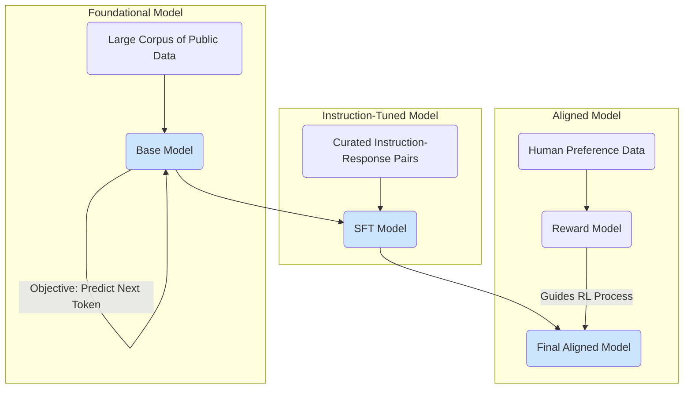

# LLM Training and Datasets

The remarkable capabilities of Large Language Models stem from their intensive training process, which is typically divided into two main stages: **Pre-training** and **Fine-tuning**. This process relies on massive, diverse datasets.

For context, you may want to review the [Introduction to LLMs](./introduction-to-llms.md).

## 1. Pre-training

The first and most computationally expensive phase is pre-training. The goal of this stage is for the model to learn general patterns of language, grammar, reasoning abilities, and world knowledge.

### The Objective: Next Token Prediction

During pre-training, the model is given a vast amount of text and trained on a very simple objective: **predict the next word (or token)**.

For example, given the text: "The quick brown fox jumps over the lazy..."

The model's goal is to predict the next word, "dog." It does this billions of times, adjusting its internal parameters after each prediction to improve its accuracy. By repeating this simple task on a massive scale, the model develops a sophisticated internal representation of language.

### Pre-training Datasets

The datasets used for pre-training are enormous, often containing hundreds of billions or even trillions of words. They are designed to be as general and diverse as possible.

Common sources include:
- **Common Crawl:** A massive, publicly available web crawl containing petabytes of data from the internet.
- **Books Corpora:** Large collections of digitized books (e.g., Google Books).
- **Wikipedia:** The entirety of Wikipedia in various languages, providing a high-quality source of factual information.
- **Code:** Publicly available code from sources like GitHub, which helps models learn programming languages and logic.

:::warning[Pre-training is not for everyone!]
The pre-training phase requires immense computational resources (hundreds or thousands of high-end GPUs running for weeks) and petabytes of data. This process is only undertaken by a handful of large, well-funded organizations. Most developers and companies will start with an existing pre-trained model and focus on the fine-tuning and alignment stages.
:::

## 2. The Full Training Pipeline

The journey from a base model to a helpful assistant follows a clear path.

## 3. Fine-Tuning and Alignment

A pre-trained model is a powerful knowledge base, but it's not inherently good at following instructions or carrying on a conversation. The fine-tuning and alignment stages adapt the model for these interactive tasks.

### Instruction Tuning (SFT)

This is the most common type of fine-tuning for creating general-purpose, helpful assistants. The model is trained on a curated dataset of `(instruction, response)` pairs.

For example:
- **Instruction:** "Summarize the following text about photosynthesis into a single paragraph."
- **Response:** A high-quality summary.

This process (which creates the SFT Model in the diagram above) teaches the model to be more helpful, follow instructions, and align its responses with user expectations.

### Alignment (RLHF)

To ensure models are safe and aligned with human values, a technique called **Reinforcement Learning from Human Feedback (RLHF)** is used. This is the final and most nuanced stage of training.
1.  **Collect Human Feedback:** Multiple model outputs for a given prompt are shown to human raters, who rank them from best to worst.
2.  **Train a Reward Model:** A separate "reward model" is trained to predict which responses humans would prefer.
3.  **Fine-tune with Reinforcement Learning:** The SFT model is then fine-tuned using reinforcement learning, using the reward model as the reward signal. This encourages the LLM to generate outputs that are more likely to be preferred by humans, resulting in the final aligned model.

This multi-stage training process is what makes modern LLMs so versatile and powerful.

## Next Steps

- **[LLM Alignment and RLHF](./alignment-and-rlhf.md):** Take a deeper look at the final, critical stage of making a model safe and helpful.
- **[LLM Model Architectures](./model-architectures.md):** Explore the different underlying architectures used for these models.
