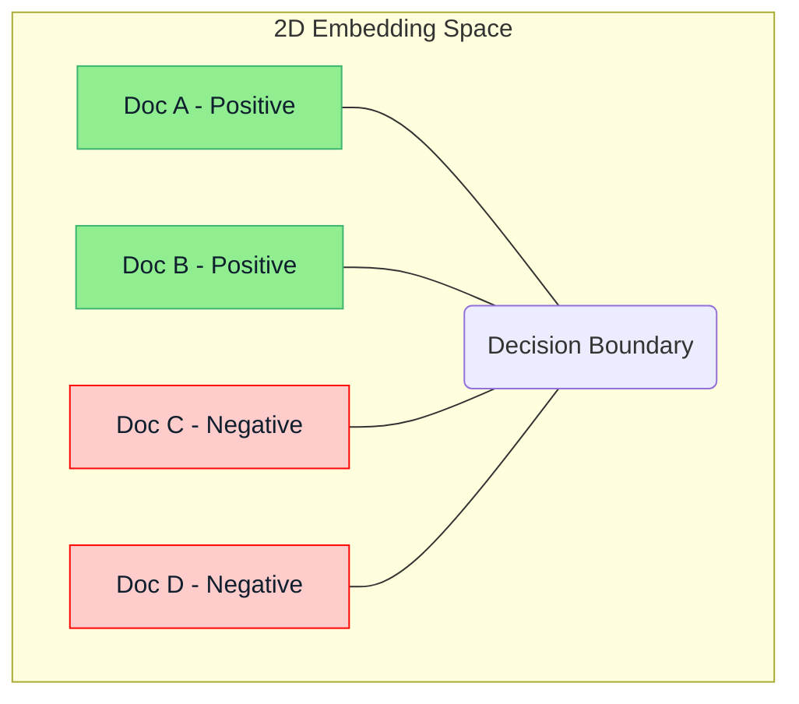

# Embedding Classification Demo

:::info[The Core Principle of Text Classification]
This demo, while simplified, illustrates one of the most important concepts in NLP: **turning words into numbers so you can do math on them**. The core idea of converting text to meaningful vectors and then using a classifier is the same principle that powers sentiment analysis, spam detection, and even more complex tasks within Large Language Models.
:::

This demo illustrates a fundamental application of word embeddings: **Text Classification**. By representing words and documents as numerical vectors, we can leverage standard machine learning algorithms to categorize text based on its semantic content. This forms the basis for many NLP applications, from spam detection to sentiment analysis.

## Concept Overview

1.  **Text to Embeddings**: Raw text (sentences, documents) is converted into numerical vectors using pre-trained word embeddings (e.g., Word2Vec, GloVe) or contextual embeddings (from models like BERT). For simplicity, this demo will average word embeddings to represent a sentence or document.
2.  **Feature Representation**: Each text document is now a single numerical vector (the "document embedding").
3.  **Classification Model**: A standard machine learning classifier (e.g., Logistic Regression, Support Vector Machine, or a simple Neural Network) is trained on these document embeddings and their corresponding labels.
4.  **Prediction**: For new, unseen text, its embedding is generated and fed to the trained classifier to predict its category.

## Actionable Insight: Beyond Keywords

:::tip[Understanding vs. Matching]
This is the critical difference between modern and traditional NLP.
*   **Keyword matching** finds documents that contain the word "happy."
*   **Embedding-based methods** find documents that *are about* happiness, even if they use words like "joyful," "ecstatic," or "content."
This shift from matching to understanding is what makes LLMs so powerful.
:::

Traditional text classification often relies on keyword matching or TF-IDF. Embedding-based classification goes a step further by understanding *meaning*. For instance, a document containing "joy" and "happiness" will be classified similarly to one with "elation" and "delight," even if they don't share exact words.

## Demo: Simple Sentiment Classification

:::warning[Heads-Up: Simplified Demo & File Download]
The following code is a **conceptual demonstration**, not a production-ready solution. It uses a tiny dataset and a very simple method (averaging embeddings) to illustrate the core idea. We discuss these limitations at the end.

To run this code, you will need to **download the `glove.6B.50d.txt` file** (approx. 175 MB) from the Stanford NLP website.
:::

Let's build a conceptual Python demo for classifying movie review sentiment (positive/negative) using pre-trained GloVe embeddings and a Logistic Regression classifier.

### Prerequisites

*   Python 3.x
*   `numpy`
*   `scikit-learn`
*   `nltk` (for tokenization, optional)
*   **Pre-trained GloVe embeddings**: Download `glove.6B.50d.txt` (50-dimensional embeddings trained on 6 Billion words from Wikipedia + Gigaword 5) from [Stanford NLP GloVe page](https://nlp.stanford.edu/projects/glove/). Place it in a `data/` directory.

### Step 1: Load Embeddings

```python
import numpy as np

def load_glove_embeddings(glove_file):
    """Loads GloVe embeddings from a file."""
    word_to_vec = {}
    with open(glove_file, 'r', encoding='utf-8') as f:
        for line in f:
            values = line.split()
            word = values[0]
            vector = np.asarray(values[1:], dtype='float32')
            word_to_vec[word] = vector
    return word_to_vec

# Path to your downloaded GloVe file
GLOVE_FILE = 'data/glove.6B.50d.txt'
word_vectors = load_glove_embeddings(GLOVE_FILE)
embedding_dim = len(next(iter(word_vectors.values())))
print(f"Loaded {len(word_vectors)} word vectors of dimension {embedding_dim}.")
# Expected Output: Loaded XXXXXX word vectors of dimension 50.
```

### Step 2: Represent Text as Document Embeddings

We'll average the word embeddings of all words in a sentence/document.

```python
import re
from nltk.tokenize import word_tokenize # pip install nltk; nltk.download('punkt')

def get_document_embedding(text, word_vectors, embedding_dim):
    """Generates an average embedding for a document."""
    tokens = word_tokenize(text.lower())
    # Remove non-alphabetic tokens and handle out-of-vocabulary words
    clean_tokens = [token for token in tokens if token.isalpha() and token in word_vectors]
    
    if not clean_tokens:
        return np.zeros(embedding_dim) # Return zero vector if no valid words
    
    doc_embedding = np.mean([word_vectors[word] for word in clean_tokens], axis=0)
    return doc_embedding

# Sample movie review data
reviews = [
    ("This movie was fantastic and truly captivating!", "positive"),
    ("Absolutely terrible, a complete waste of time.", "negative"),
    ("The plot was okay, but the acting was poor.", "negative"),
    ("A masterpiece of cinema, highly recommend!", "positive"),
    ("It was an average film, nothing special.", "negative"), # Misleading label to show limits
]

X = [] # Document embeddings
y = [] # Labels (0 for negative, 1 for positive)

for review_text, sentiment_label in reviews:
    doc_embed = get_document_embedding(review_text, word_vectors, embedding_dim)
    X.append(doc_embed)
    y.append(1 if sentiment_label == "positive" else 0)

X = np.array(X)
y = np.array(y)

print(f"Generated {len(X)} document embeddings.")
```

### Step 3: Train a Classifier

```python
from sklearn.model_selection import train_test_split
from sklearn.linear_model import LogisticRegression
from sklearn.metrics import accuracy_score, classification_report

# Split data (for a real project, much more data is needed)
X_train, X_test, y_train, y_test = train_test_split(X, y, test_size=0.2, random_state=42)

# Train a simple Logistic Regression classifier
classifier = LogisticRegression(max_iter=200) # Increased max_iter for convergence
classifier.fit(X_train, y_train)

# Make predictions
y_pred = classifier.predict(X_test)

# Evaluate
print("\nAccuracy:", accuracy_score(y_test, y_pred))
print("\nClassification Report:\n", classification_report(y_test, y_pred))
```

### Step 4: Make a Prediction on New Text

```python
new_review = "I found the movie quite engaging and well-produced, definitely worth watching."
new_review_embed = get_document_embedding(new_review, word_vectors, embedding_dim).reshape(1, -1)

prediction = classifier.predict(new_review_embed)
sentiment = "positive" if prediction[0] == 1 else "negative"

print(f"\nNew review: '{new_review}'")
print(f"Predicted sentiment: {sentiment}")
```

## Visual Suggestion: Embedding Space with Decision Boundary



This visual would powerfully show how the classifier uses the spatial arrangement of embeddings to make decisions.

## Limitations of this Simple Demo

:::info[From Limitations to Innovation]
The limitations listed here are not just flaws in the demo; they are the very **reasons that more advanced models were invented**.
*   Losing word order by averaging embeddings led to the development of **RNNs**.
*   The fixed, context-independent nature of GloVe embeddings led to the creation of contextual models like **BERT**.
*   The need to process sequences more efficiently led to the **Transformer architecture**.
Understanding these limitations helps you appreciate why the models we use today are designed the way they are.
:::

*   **Averaging Embeddings**: Simple averaging loses word order and specific contextual nuances. More advanced methods (like LSTMs, GRUs, or Transformers) are needed for richer representations.
*   **Small Dataset**: Real-world classification requires much larger, balanced, and diverse datasets.
*   **Pre-trained Embeddings**: GloVe is context-independent. Modern LLMs use contextual embeddings (e.g., BERT, GPT) where a word's vector changes based on its surrounding words in a sentence, capturing polysemy.

## Next Steps

This demo provides a hands-on feel for how embeddings power text classification. Next, we will delve into [Sequential Data, RNNs, and the Encoder-Decoder Model](../04-sequential-models/introduction-to-sequential-data-and-rnn.md), which represent an evolution in handling ordered linguistic information more effectively.