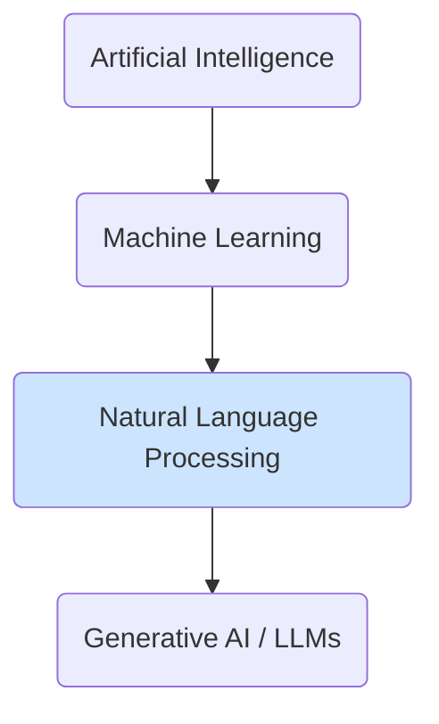

# Introduction to Natural Language Processing (NLP)

Natural Language Processing (NLP) is a field of artificial intelligence (AI) that focuses on enabling computers to understand, interpret, and generate human language in a way that is both meaningful and useful. It's the bridge between human communication and computer understanding.

## Why NLP is a Foundation for Generative AI

At its core, Generative AI that deals with text (like Large Language Models) is an advanced application of NLP. Before a model can generate coherent and contextually relevant text, it must first be able to understand it.

NLP provides the foundational techniques for:

- **Tokenization:** Breaking down text into smaller units, like words or sub-words.
- **Embeddings:** Representing these tokens as numerical vectors that capture their semantic meaning.
- **Syntactic Analysis:** Understanding the grammatical structure of sentences.
- **Semantic Analysis:** Discerning the meaning and intent behind the text.

:::note[What is Tokenization?]
Tokenization is the first step in any NLP pipeline. It's the process of splitting a piece of text into smaller pieces, or "tokens". For example, the sentence "The cat sat" might be tokenized into `["The", "cat", "sat"]`. Modern models often use "sub-word" tokenization, where a word like "tokenization" might be split into `["token", "ization"]` to better handle complex words and grammar.
:::

## Core NLP Tasks

Many foundational NLP tasks are building blocks for the complex capabilities of modern LLMs:

- **Text Classification:** Categorizing text into predefined groups (e.g., sentiment analysis, topic classification).
- **Named Entity Recognition (NER):** Identifying and classifying key information (entities) in text, such as names, dates, and locations.
- **Machine Translation:** Translating text from one language to another.
- **Question Answering:** Providing answers to questions posed in natural language.
- **Summarization:** Creating a concise summary of a longer text.

While LLMs can now perform many of these tasks with surprising accuracy (often with zero or few-shot prompting), understanding the original NLP problems provides crucial context for how these models work and how to apply them effectively.

## Next Steps

- **[Sequential Models](../04-sequential-models/introduction-to-sequential-models.md):** Learn about the classic NLP models like RNNs and LSTMs that were the precursors to the modern Transformer architecture.
