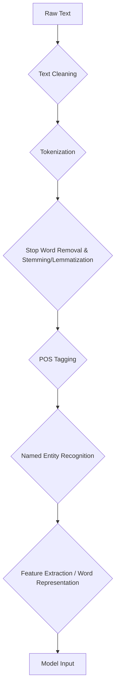

# Natural Language Processing Pipeline

:::info[A Conceptual Framework, Not a Strict Recipe]
While we present the NLP Pipeline as a series of linear steps, it's crucial to understand that for modern LLMs, this is more of a **conceptual framework** than a rigid, manual process. Many of these stages (like POS tagging, stemming, and feature extraction) are handled implicitly and in a highly integrated way within the model's architecture during training. Understanding the pipeline helps you reason about what the model is doing under the hood.
:::

The Natural Language Processing (NLP) pipeline refers to the systematic series of steps applied to raw text data to transform it into a more structured and analyzable format. This processing is crucial for preparing data for machine learning models, including Large Language Models (LLMs), enabling them to extract meaningful information and perform complex tasks.

## Stages of a Typical NLP Pipeline

While the exact steps can vary depending on the specific task and dataset, a common NLP pipeline often includes the following stages:

### 1. Text Acquisition (Corpus Creation)

*   **Description**: Gathering raw text data from various sources such as web pages, books, social media, databases, or speech-to-text transcripts.
*   **Actionable Insight**: Data quality here is paramount. Noise, inconsistencies, and bias in the raw data will propagate through the entire pipeline and affect downstream models. Always consider the representativeness of your corpus.

### 2. Text Cleaning and Preprocessing

This is often the first and most critical step for raw, unstructured text.

*   **Noise Removal**: Eliminating irrelevant characters, HTML tags, special symbols, or duplicate entries.
*   **Case Normalization**: Converting all text to a uniform case (e.g., lowercase) to treat "Apple" and "apple" as the same word.
*   **Standardization**: Correcting misspellings, expanding contractions (e.g., "don't" to "do not"), and handling abbreviations.
*   **Actionable Insight**: Thorough cleaning significantly improves model performance and reduces the complexity of subsequent steps.

    :::caution Be Careful Not to "Over-clean"
    For traditional models, aggressive cleaning was essential. For modern LLMs, however, some "noise" can be a valuable signal. For example, converting everything to lowercase might lose the distinction between "Apple" (the company) and "apple" (the fruit). Punctuation can also convey tone. The best practice is to perform minimal cleaning (e.g., removing HTML tags) and let the model handle the nuances.
    :::

### 3. Tokenization

*   **Description**: Breaking down the cleaned text into individual units (tokens). As discussed in the [Introduction to NLP](./introduction-to-nlp.md), these can be words, subwords, or characters.
*   **Visual Suggestion**:
    ```mermaid
    graph TD
        A[Raw Text] --> B{Tokenizer};
        B --> C[Token 1];
        B --> D[Token 2];
        B --> E[...];
    ```
*   **Actionable Insight**: Different tokenization strategies (e.g., WordPiece, BPE) have different implications for vocabulary size, handling out-of-vocabulary words, and the length of sequences fed to models like Transformers.

### 4. Stop Word Removal

*   **Description**: Removing frequently occurring words (e.g., "a", "an", "the", "is") that generally do not contribute significantly to the semantic meaning of a sentence.
*   **Actionable Insight**: Essential for tasks like text classification or information retrieval where the focus is on content-bearing words. For LLMs, stop words are often retained as they are crucial for grammatical fluency.

### 5. Stemming & Lemmatization

*   **Description**: Reducing words to their root form.
    *   **Stemming**: `running -> run`
    *   **Lemmatization**: `better -> good`
*   **Actionable Insight**: Useful for reducing the vocabulary size and improving the recall of search systems, but careful consideration is needed as it can sometimes lose subtle semantic distinctions.

### 6. Part-of-Speech (POS) Tagging

*   **Description**: Assigning grammatical tags (e.g., Noun, Verb, Adjective) to each token.
*   **How it Works**: Often uses statistical models or rule-based systems trained on annotated corpora.
*   **Actionable Insight**: Provides syntactic information crucial for tasks like parsing, named entity recognition, and coreference resolution.

### 7. Named Entity Recognition (NER)

*   **Description**: Identifying and classifying named entities in text (e.g., persons, organizations, locations, dates).
*   **Actionable Insight**: Converts unstructured text into structured data, facilitating knowledge extraction and populating databases.

### 8. Feature Extraction / Word Representation

*   **Description**: Converting tokens into numerical representations (vectors) that machine learning models can understand.
*   **Techniques**:
    *   **Bag-of-Words (BoW)**: Simple frequency counts of words.
    *   **TF-IDF (Term Frequency-Inverse Document Frequency)**: Weights words by their importance in a document relative to a corpus.
    *   **Word Embeddings**: Dense vector representations that capture semantic relationships between words (e.g., Word2Vec, GloVe). This is a critical step for deep learning models.
*   **Actionable Insight**: The choice of representation directly impacts the model's ability to capture semantic meaning and context. Word embeddings are foundational for modern LLMs.

    :::info[The Heart of Modern NLP]
    This stage is where modern deep learning models, especially LLMs, truly shine. Instead of relying on manually crafted features like TF-IDF, these models **learn** the representations (embeddings) from the data itself. This learned, contextual representation is what allows an LLM to understand that "bank" means something different in "river bank" versus "investment bank."
    :::

## NLP Pipeline Example Flow



## The Pipeline's Role in Modern LLMs

:::tip[Where Pipeline Thinking is Still Essential: RAG]
The concept of a multi-step pipeline is highly relevant in modern systems like **Retrieval-Augmented Generation (RAG)**. In a RAG system, you must explicitly build a pipeline to:
1.  **Acquire** data (e.g., from a knowledge base).
2.  **Clean and Chunk** it into manageable pieces.
3.  **Embed** those chunks into vectors for searching.
4.  **Retrieve** relevant chunks and pass them to the LLM as context.
This is a modern reimplementation of the classic NLP pipeline.
:::

While LLMs perform many of these steps internally or learn representations end-to-end, understanding the traditional NLP pipeline is vital for:
*   **Preprocessing Input**: Ensuring clean, consistent data prior to feeding it to an LLM, especially for fine-tuning or RAG applications.
*   **Interpreting Outputs**: Analyzing LLM outputs for specific entities or grammatical correctness.
*   **Debugging**: Pinpointing issues related to tokenization, vocabulary, or representation.

## Next Steps

Dive deeper into the critical concept of [Word Embeddings](./word-embeddings.md), the numerical foundation for semantic understanding in NLP and LLMs.