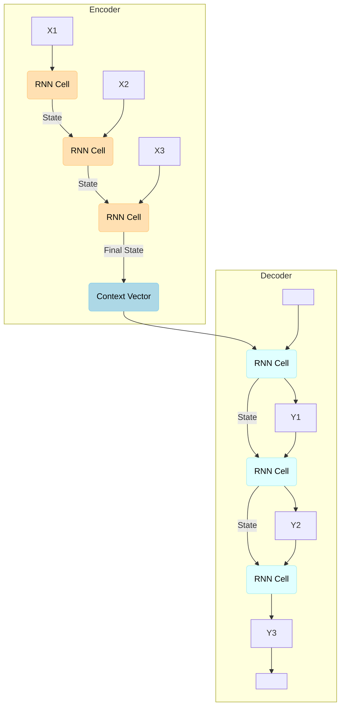

# Encoder-Decoder Model

:::info[Analogy: The Human Translator]
The Encoder-Decoder model works much like a human translator.
1.  **The Encoder** is the translator listening to an entire sentence in one language, building a complete mental picture of its meaning. This mental picture is the "context vector."
2.  **The Decoder** is the translator then taking that mental picture and speaking a new sentence in the target language, word by word.
The key idea is this two-step process: first understand, then generate.
:::

The **Encoder-Decoder model** is a powerful and widely adopted neural network architecture designed for **sequence-to-sequence (Seq2Seq)** tasks. These are tasks where the input is a sequence, and the output is also a sequence, but often of a different length or type. This model architecture was a significant breakthrough for applications like machine translation and text summarization, directly influencing the development of the Transformer architecture used in modern LLMs.

## What is a Sequence-to-Sequence (Seq2Seq) Task?

A Seq2Seq task involves mapping an input sequence $X = (x_1, x_2, ..., x_n)$ to an output sequence $Y = (y_1, y_2, ..., y_m)$, where $n$ and $m$ can be different.

**Examples**:
*   **Machine Translation**: English sentence $\rightarrow$ French sentence ($n \neq m$)
*   **Text Summarization**: Long document $\rightarrow$ Short summary ($n > m$)
*   **Question Answering**: Question + Context $\rightarrow$ Answer

## Architecture of the Encoder-Decoder Model

The Encoder-Decoder model, at its core, consists of two main RNNs (often LSTMs or GRUs) that work in tandem:

### 1. The Encoder

:::tip[The Encoder's Job: Create a Summary]
The entire job of the encoder is to read the input sequence and create a single, dense numerical summary of it. This summary, the **context vector**, is expected to capture the complete "meaning" or "intent" of the input sequence.
:::

*   **Role**: Reads the entire input sequence $X$ word by word (or token by token) and compresses all the information into a fixed-size representation called the **context vector** (or thought vector, or latent representation).
*   **Process**: It iterates through the input sequence, updating its hidden state at each time step. The final hidden state of the encoder is typically taken as the context vector.
*   **Limitation**: For long input sequences, compressing all information into a single fixed-size context vector can lead to information loss (the "bottleneck" problem).

### 2. The Decoder

:::tip[The Decoder's Job: Write from the Summary]
Following the analogy, the decoder's job is to act as a writer who is given *only* the encoder's summary (the context vector) and nothing else. From that single summary, it must generate a brand new, coherent output sequence. This highlights how much pressure is put on the quality of the context vector.
:::

*   **Role**: Takes the context vector from the encoder as its initial hidden state and generates the output sequence $Y$ one element at a time.
*   **Process**: At each time step, the decoder receives the previous hidden state, the context vector, and the previously generated output word (or a special "start-of-sequence" token for the first step) to predict the next word in the output sequence. The predicted word is then fed back as an input to the decoder at the next time step.
*   **Conditioning**: The decoder is effectively "conditioned" on the input sequence through the context vector.

## Visual Suggestion: Encoder-Decoder Diagram

## Training the Encoder-Decoder Model

The model is trained end-to-end to maximize the probability of the correct output sequence given the input sequence. The training process involves:

1.  Feeding an input sequence to the encoder.
2.  Obtaining the context vector.
3.  Using the context vector and the actual target output sequence to train the decoder, usually employing teacher forcing (feeding the actual target output of the previous step as input to the current decoder step).
4.  Backpropagating the error through both the decoder and the encoder.

## Limitations and the Rise of Attention

:::info[The Bottleneck That Inspired a Revolution]
The **information bottleneck** of the fixed-size context vector is one of the most important problems in the history of NLP. The question "How can we expect a single vector to summarize a 100-word sentence?" was the direct motivation for the invention of the **Attention Mechanism**. Instead of relying on a single summary, attention allowed the decoder to "look back" and focus on different parts of the input sequence at each step of its generation process. This idea completely changed the game and led directly to the Transformer.
:::

The primary limitation of the vanilla Encoder-Decoder model is the fixed-size context vector. As mentioned, for very long input sequences, it becomes increasingly difficult for this single vector to encapsulate all relevant information, leading to:

*   **Information Bottleneck**: The context vector becomes a bottleneck, forcing the model to forget earlier parts of the input.
*   **Difficulty with Long Sequences**: Performance degrades significantly with longer inputs.

This limitation was elegantly addressed by the introduction of **Attention Mechanisms**, which allowed the decoder to "look back" at different parts of the input sequence during decoding, providing a more dynamic context vector at each step. This innovation was a crucial precursor to the Transformer architecture.

## Relevance to Generative AI and LLMs

The Encoder-Decoder framework established the paradigm for handling complex sequence-to-sequence mappings. It showcased how neural networks could generate novel sequences. The concepts of an encoder extracting features and a decoder generating outputs are fundamental. While modern LLMs often use decoder-only architectures (especially for pure generation tasks), the underlying principles of sequence processing and contextual representation established by the Encoder-Decoder model (and then enhanced by attention) are core to their functionality.

## Next Steps

The bottleneck of the fixed-size context vector led directly to the development of the [Attention Mechanism](../05-attention-and-transformers/attention-mechanism.md), a groundbreaking innovation we will explore next.