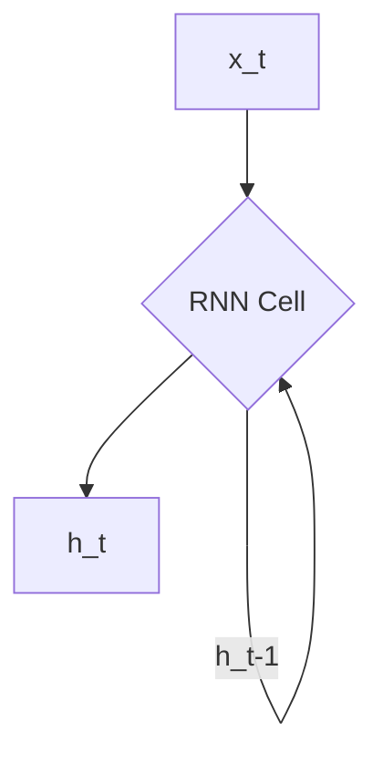
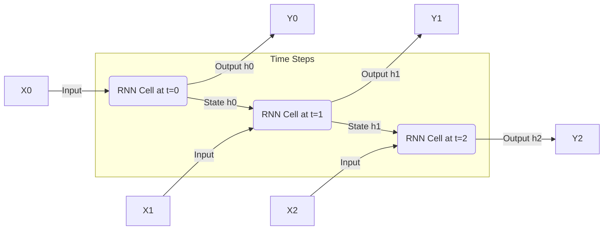

# Introduction to Sequential Data and Recurrent Neural Networks (RNNs)

:::info[The Next Step: Understanding Order]
In the previous section, we saw how to give words meaning through embeddings. But language is more than a bag of meaningful words; it's a **sequence**. The order of words is critical. This section introduces Recurrent Neural Networks (RNNs), the first major architecture designed specifically to understand and process the order and context within sequential data.
:::

In the real world, much of the data we encounter has an inherent order or sequence. Think about:
*   **Text**: Words in a sentence, sentences in a paragraph.
*   **Speech**: Phonemes in a word, words in a spoken phrase.
*   **Time Series**: Stock prices over time, sensor readings, weather data.
*   **Video**: Frames in a movie.

This is known as **Sequential Data**, and its key characteristic is that the order matters. The meaning of a word often depends on the words that precede it, just as tomorrow's weather depends on today's.

## The Challenge of Sequential Data

Traditional neural networks, like Multilayer Perceptrons (MLPs), struggle with sequential data because they assume inputs are independent. If you feed an MLP a sentence word by word, it would treat "apple" in "I eat an apple" as unrelated to "apple" in "Apple is a tech company." It also cannot handle variable-length sequences efficiently.

This lack of **memory** and inability to handle **variable-length inputs** were major limitations that gave rise to a new class of neural networks.

## Recurrent Neural Networks (RNNs) to the Rescue

Recurrent Neural Networks (RNNs) were specifically designed to address these challenges. Their defining characteristic is their ability to **process sequences by maintaining an internal state or "memory"** of past inputs.

### The Recurrent Nature

:::tip[An Analogy: The Hidden State as a Running Summary]
You can think of the RNN's hidden state (`h_t`) as a **running summary** of the sequence it has seen so far. As the RNN reads each word, it updates its summary. When it sees the word "apple," its summary helps it guess whether the context is about fruit ("...I ate an **apple**") or technology ("...I bought an **Apple** laptop").
:::

Unlike feedforward networks where information flows in one direction, RNNs have loops (recurrences) that allow information to be passed from one step of the sequence to the next.

**Visual Suggestion**: A diagram showing a simple RNN cell with an input `x_t`, an output `h_t`, and a recurrent connection feeding `h_{t-1}` back into the cell for the next time step. Also, show the "unrolled" version of the RNN over several time steps.

**Unrolled Version**:

### Key Characteristics of RNNs

1.  **Memory**: The hidden state (`h_t`) acts as a memory, encoding information about all previous time steps in the sequence.
2.  **Parameter Sharing**: The same RNN cell (with the same set of weights) is applied at every time step. This means the model learns to perform the same task (e.g., finding relationships) at different positions in the sequence, making it efficient for variable-length inputs.
3.  **Variable-Length Inputs/Outputs**: RNNs can naturally handle sequences of arbitrary length, producing an output at each step or a single output after the entire sequence is processed.

## Common Use Cases for RNNs

RNNs, and their more advanced variants, became foundational for a wide range of tasks involving sequential data:

*   **Language Modeling**: Predicting the next word in a sentence (a core task that LLMs excel at).
*   **Speech Recognition**: Transcribing spoken words into text.
*   **Machine Translation**: Translating a sequence of words from one language to another.
*   **Time Series Prediction**: Forecasting future values based on historical data.
*   **Sentiment Analysis**: Determining the sentiment of a sentence or document by considering the sequence of words.

## Actionable Insight: The Power of Context

:::info[The Birth of Context-Awareness]
This is a critical takeaway. The ability of RNNs to carry information forward was the first real attempt at making a neural network **context-aware**. While the Transformer architecture does this in a much more sophisticated way (with its attention mechanism), the fundamental idea of using past information to interpret the present began right here with RNNs.
:::

RNNs illustrate a crucial concept in NLP and LLMs: the importance of context. By leveraging information from previous words, RNNs can disambiguate meaning and generate more coherent outputs. This "context awareness" is taken to an extreme in the Transformer architecture, but the fundamental idea originates here.

## Limitations of Basic RNNs

:::warning[The Motivation for What's Next]
Pay close attention to these limitations, as they are the **direct motivation** for the next evolution of models.
*   The **vanishing gradient** problem directly led to the invention of LSTMs and GRUs, which have "gates" to better control the flow of information.
*   The struggle with **long-range dependencies** was the primary weakness that the Transformer architecture's attention mechanism was designed to solve.
These aren't just flaws; they are the signposts on the road to modern LLMs.
:::

While groundbreaking, basic RNNs suffer from several issues, most notably:
*   **Vanishing/Exploding Gradients**: During training, gradients can become too small or too large, making it hard to learn long-range dependencies.
*   **Short-term Memory**: Despite having a "memory," basic RNNs struggle to effectively remember information over very long sequences.

These limitations led to the development of more sophisticated recurrent architectures like LSTMs and GRUs, which we will explore in subsequent sections.

## Next Steps

Understand how RNNs are adapted to different types of sequence processing tasks by exploring the [Types of RNNs based on Cardinality](./types-of-rnn-cardinality.md).