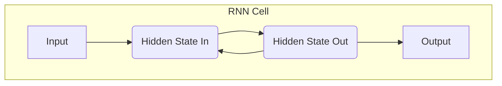
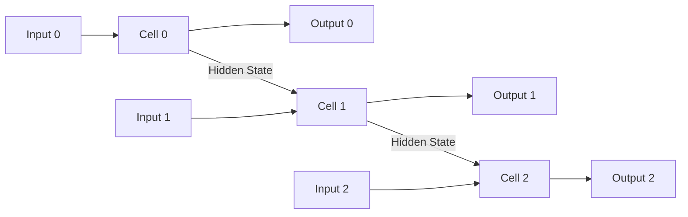

# Introduction to Sequential Models

Sequential models are a class of neural networks designed to handle sequential data, where the order of information is crucial. Human language is a prime example of sequential data—the order of words determines the meaning of a sentence.

## The Challenge of Sequential Data

Traditional neural networks (like feed-forward networks) process inputs independently, without any memory of past inputs. This makes them unsuitable for tasks where context is key.

For example, to predict the next word in the sentence "The cat sat on the...", the model needs to remember the words "The," "cat," "sat," "on," and "the."

## Recurrent Neural Networks (RNNs)

Recurrent Neural Networks (RNNs) were developed to address this challenge. They feature a "hidden state" that acts as a form of memory. As the RNN processes a sequence, it passes its hidden state from one step to the next, allowing it to retain information from earlier in the sequence.

This can be easier to visualize as an "unrolled" sequence:

### Limitations of Simple RNNs

While revolutionary, simple RNNs suffer from two major issues:

1.  **Vanishing Gradients:** As sequences get longer, the signal (gradient) from earlier steps can become so small that the model struggles to learn long-range dependencies. It might forget the beginning of a sentence by the time it reaches the end.
2.  **Exploding Gradients:** In some cases, the gradients can grow exponentially, making the training process unstable.

:::warning[The Vanishing Gradient Problem]
The vanishing gradient problem was the single biggest obstacle for sequential models. Because the signal from past events faded so quickly, RNNs struggled to connect a pronoun at the end of a long paragraph with the noun it referred to at the beginning. This fundamental limitation is what the Transformer architecture's self-attention mechanism was designed to solve.
:::

## LSTMs and GRUs: An Improvement

To overcome these limitations, more advanced RNN architectures were developed:

-   **Long Short-Term Memory (LSTM):** LSTMs introduce a more complex internal structure with "gates" (input, forget, and output gates). These gates regulate the flow of information, allowing the network to selectively remember or forget information over long sequences.
-   **Gated Recurrent Units (GRU):** GRUs are a simplified version of LSTMs with fewer parameters. They merge the cell state and hidden state and use a simpler gating mechanism, making them more computationally efficient in some cases.

## Next Steps

Before the rise of the Transformer architecture, RNNs, LSTMs, and GRUs were the state-of-the-art for most NLP tasks. Understanding their architecture and limitations is key to appreciating the innovations brought by the next generation of models.

- **[The Attention Mechanism and Transformers](../05-attention-and-transformers/introduction-to-attention.md):** Learn about the architecture that solved the long-range dependency problem and changed the course of AI.
