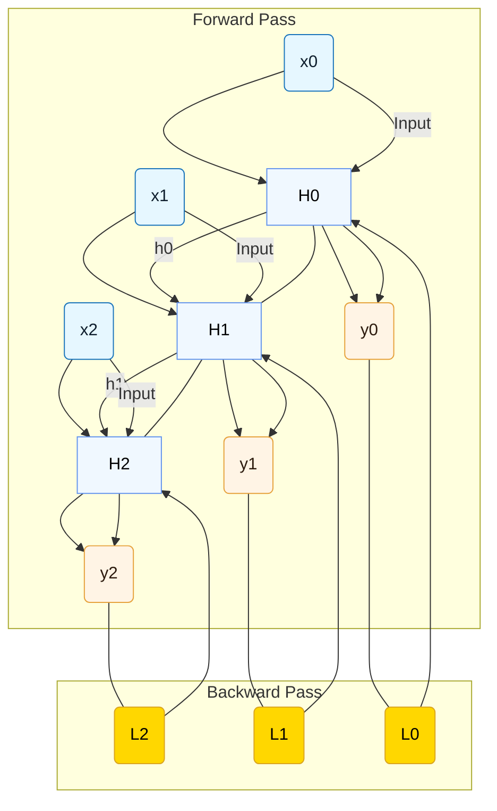

# Training RNNs: Backpropagation Through Time (BPTT)

:::info[Teaching a Model with Memory]
How do you teach a model that has a memory? If an RNN makes a mistake at the end of a long sentence, how do you know if the error was caused by the last word, the first word, or somewhere in between? **Backpropagation Through Time (BPTT)** is the algorithm designed to solve this. It's a method for assigning credit (or blame) for an outcome across a whole sequence of past actions, allowing the model to learn from its temporal experiences.
:::

Training Recurrent Neural Networks (RNNs) is more complex than training feedforward networks due to their recurrent connections and the temporal dependencies they model. The primary algorithm used for this is **Backpropagation Through Time (BPTT)**, which is essentially an extension of the standard backpropagation algorithm applied over the unrolled RNN structure.

## The Concept of BPTT

:::tip[Analogy: Reviewing the Project Timeline]
Imagine a project manager reviewing a project that went wrong. They don't just look at the final step; they "unroll" the entire timeline to see how an early decision influenced a later one, and how that ultimately led to the final error. BPTT does exactly this for an RNN. It unrolls the sequence of computations and traces the error backwards through time to see how each step contributed to the final mistake.
:::

Recall that an RNN processes a sequence by applying the same set of weights at each time step, and the hidden state from the previous time step is fed as an input to the current time step. When computing gradients for these shared weights, we need to account for their influence across all time steps.

BPTT works by:

1.  **Unrolling the RNN**: First, the RNN is "unrolled" into a feedforward-like network, where each time step is treated as a separate layer. This creates a computational graph that explicitly shows the dependencies between inputs, hidden states, and outputs across the sequence.
2.  **Forward Pass**: The input sequence is fed through the unrolled network, computing hidden states and outputs for each time step. The network predicts an output (or a sequence of outputs) and calculates the loss.
3.  **Backward Pass (Backpropagation)**: The gradients of the loss with respect to the network's weights are calculated by propagating the error backwards *through each time step* of the unrolled network, starting from the last time step. This means the gradients at a given time step depend not only on the current loss but also on the errors propagated from future time steps.
4.  **Weight Update**: The gradients are then accumulated across all time steps, and the weights (which are shared across all time steps) are updated using an optimization algorithm (e.g., Stochastic Gradient Descent).

## Visual Suggestion: Unrolled RNN with BPTT Flow

## Challenges with BPTT

Despite its effectiveness, BPTT, especially in its basic form, introduces several significant challenges when training RNNs, particularly for long sequences:

### 1. Vanishing Gradients

*   **Problem**: As the error signal is backpropagated through many time steps (layers), the gradients can shrink exponentially, becoming extremely small. This means that the influence of earlier inputs on the final output becomes negligible, making it difficult for the RNN to learn long-range dependencies.
*   **Analogy**: Imagine trying to hear a whisper at the beginning of a very long corridor. The signal fades before it reaches the end.
*   **Actionable Insight**: RNNs often struggle with tasks where information from far back in the sequence is crucial (e.g., understanding the context of a pronoun a few sentences ago).

    :::info[The Problem That Sparked an Evolution]
    The **vanishing gradient problem** is more than just a challenge; it's the primary reason that more advanced architectures like **LSTMs (Long Short-Term Memory)** and **GRUs (Gated Recurrent Units)** were invented. These models introduced "gates" – mechanisms designed specifically to control what information is remembered and what is forgotten, allowing them to combat the vanishing gradient problem and learn much longer-range dependencies.
    :::

### 2. Exploding Gradients

*   **Problem**: Conversely, gradients can grow exponentially large during backpropagation, leading to very large weight updates that destabilize the network and cause it to diverge (e.g., weights becoming `NaN`).
*   **Analogy**: A small nudge at the beginning of a domino chain causing a massive impact at the end.
*   **Actionable Insight**: Exploding gradients are generally easier to detect and mitigate (e.g., using gradient clipping, where gradients are rescaled if they exceed a certain threshold).

### 3. Computational Cost

*   **Problem**: BPTT requires unrolling the RNN for the entire sequence, which can be computationally expensive and memory-intensive for very long sequences.
*   **Solution**: Often, a "truncated BPTT" is used, where gradients are only backpropagated through a fixed number of recent time steps instead of the entire sequence. This reduces computational cost but further limits the ability to learn very long-range dependencies.

    :::tip[Truncated BPTT: A Practical Compromise]
    Think of Truncated BPTT as making a decision based on recent history instead of ancient history. Instead of reviewing the entire project timeline from the beginning, you only look at the last week of activity. It's a practical compromise that saves a lot of time and memory, but at the cost of potentially missing a critical event that happened a month ago.
    :::

## Implications for Language Models

The challenges of BPTT, particularly vanishing gradients and the difficulty of learning long-range dependencies, were a major driving force behind the development of more advanced RNN architectures like LSTMs and GRUs, and ultimately, the Transformer architecture. These newer models were designed specifically to overcome these "short-term memory" issues inherent in basic RNNs.

## Next Steps

Explore how more advanced RNN architectures address these challenges by looking at the specific [Types of RNNs beyond the basic cell](./types-of-rnns.md), such as LSTMs and GRUs.