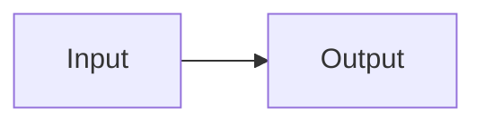
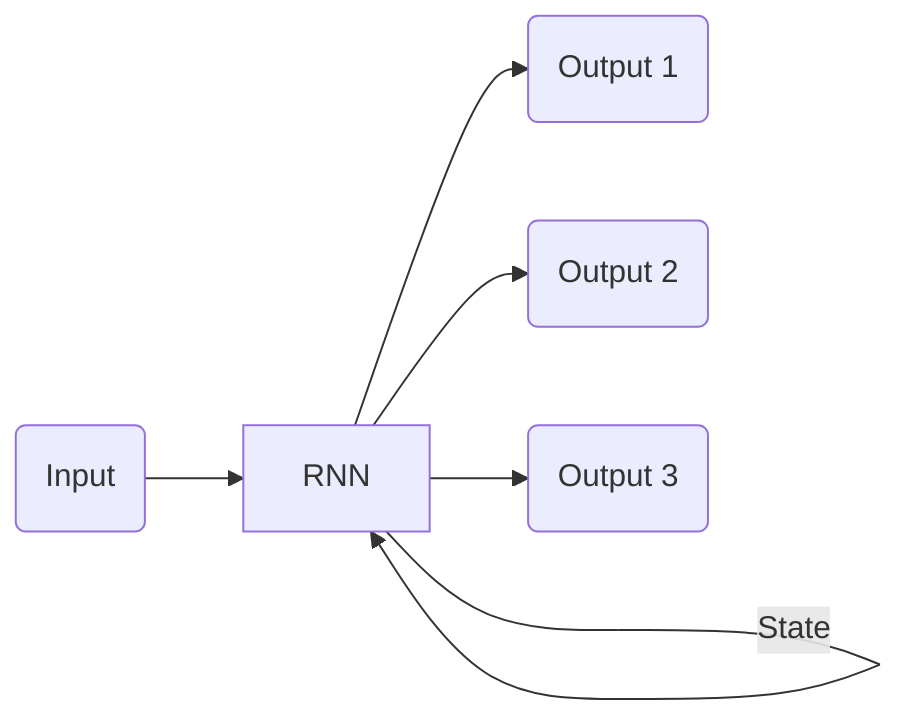
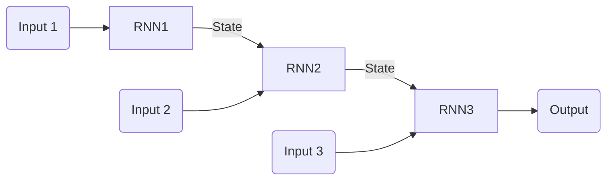
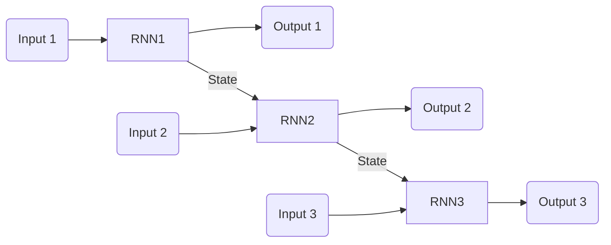
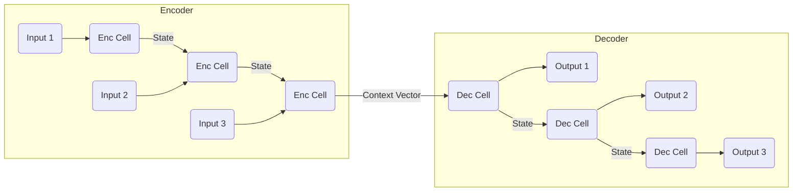

# Types of RNNs Based on Cardinality

:::info[Different Blueprints for Different Problems]
Think of the different RNN types not as fundamentally different models, but as different **blueprints** for using the same core RNN cell. The underlying mechanics of the cell (processing one item and passing on a hidden state) remain the same. What changes is how you wire it up to handle the specific input and output shapes your problem requires.
:::

Recurrent Neural Networks (RNNs) are highly versatile and can be configured in various ways to handle different types of sequential data tasks. A common way to categorize RNN architectures is by the relationship between the number of inputs and the number of outputs in a sequence, often referred to as **cardinality**.

Understanding these different types helps in selecting the right RNN architecture for a specific problem.

## 1. One-to-One (Vanilla Neural Networks)

*   **Input**: Single input (e.g., a single image).
*   **Output**: Single output (e.g., a single label).
*   **Description**: This is the simplest form, essentially a traditional feedforward neural network (like a Multi-Layer Perceptron) applied to a single data point. It doesn't truly leverage the recurrent nature for sequence processing, as there's no temporal dependency.
*   **Application**: Image classification, standard classification tasks.
    *   **Visual Suggestion**: A single node representing input, connected to a single node representing output.

## 2. One-to-Many

*   **Input**: Single input.
*   **Output**: Sequence of outputs.
*   **Description**: The RNN takes a single input and generates a sequence. The internal state of the RNN is maintained and updated as it generates each element of the output sequence.
*   **Application**:
    *   **Image Captioning**: Input an image, output a descriptive sentence.
    *   **Music Generation**: Input a genre/style, output a sequence of notes.
*   **Actionable Insight**: The single input often acts as an initial context or seed from which the sequence is generated.

    :::tip[Analogy: The Artist's Prompt]
    A great analogy for the one-to-many architecture is giving a single prompt to an artist.
    *   **Input**: "A futuristic city at sunset."
    *   **Output Sequence**: The artist (the RNN) generates a sequence of brushstrokes, colors, and shapes to create the final painting.
    The initial prompt sets the context for the entire generated sequence.
    :::
    *   **Visual Suggestion**: A single input node feeding into an RNN cell, which then produces multiple output nodes sequentially.

## 3. Many-to-One

*   **Input**: Sequence of inputs.
*   **Output**: Single output.
*   **Description**: The RNN processes an entire input sequence and then produces a single output that summarizes or classifies the sequence. The final hidden state of the RNN often contains the aggregated information from the entire sequence.
*   **Application**:
    *   **Sentiment Analysis**: Input a sentence (sequence of words), output its sentiment (positive/negative).
    *   **Spam Detection**: Input an email (sequence of words), output whether it's spam or not.
    *   **Video Classification**: Input a sequence of video frames, output the action performed.
*   **Actionable Insight**: This architecture is excellent for tasks where the overall meaning or categorization of a sequence is required.

    :::tip[Analogy: The Funnel]
    This architecture acts like a **funnel**. It takes in a lot of information (a sequence of words, a series of video frames) and distills it all down into a single, conclusive output, such as "positive sentiment" or "this is a cat video." The final output is a summary judgment of the entire sequence.
    :::
    *   **Visual Suggestion**: Multiple input nodes feeding sequentially into an RNN cell, with a single output node at the very end.

## 4. Many-to-Many (Synchronous / Same Length)

*   **Input**: Sequence of inputs.
*   **Output**: Sequence of outputs, where each input corresponds to one output. The input and output sequences have the same length.
*   **Description**: The RNN produces an output at each time step, synchronized with the input sequence. The hidden state is passed along, maintaining context.
*   **Application**:
    *   **Part-of-Speech (POS) Tagging**: Input a sentence (sequence of words), output the POS tag for each word.
    *   **Named Entity Recognition (NER)**: Input a sentence, output the entity label for each word.
*   **Actionable Insight**: Ideal for tasks where a label or classification is needed for each element within an input sequence.
    *   **Visual Suggestion**: Multiple input nodes feeding sequentially into an RNN cell, with each RNN cell also producing an output.

## 5. Many-to-Many (Asynchronous / Encoder-Decoder)

*   **Input**: Sequence of inputs.
*   **Output**: Sequence of outputs, where the input and output sequences can have different lengths.
*   **Description**: This is a more complex architecture typically composed of two main parts:
    *   **Encoder**: Processes the entire input sequence, compressing its information into a fixed-size context vector (the final hidden state).
    *   **Decoder**: Takes the context vector from the encoder and generates the output sequence one element at a time.
*   **Application**:
    *   **Machine Translation**: Input a sentence in language A, output a sentence in language B (different lengths are common).
    *   **Text Summarization**: Input a long document, output a shorter summary.
    *   **Question Answering**: Input a question and context, output an answer.
*   **Actionable Insight**: This architecture is foundational for sequence-to-sequence tasks and is a direct precursor to the Transformer architecture used in LLMs.

    :::info[A Foundational Leap Towards Transformers]
    Pay special attention to this architecture. The **Encoder-Decoder** model is arguably the most important conceptual stepping stone on the path to modern LLMs. The idea of compressing an entire input sequence into a "context vector" and then having a separate decoder generate an output from it was a revolutionary idea. The Transformer architecture, which powers models like GPT, is a more advanced and powerful implementation of this same fundamental Encoder-Decoder concept.
    :::
    *   **Visual Suggestion**: A sequence of inputs feeding into an "Encoder" block, which outputs a single context vector. This context vector then feeds into a "Decoder" block, which outputs a sequence.

## Relevance to Generative AI and LLMs

The Many-to-Many (Encoder-Decoder) architecture became critically important for tasks like machine translation, which eventually paved the way for the Transformer architecture. LLMs, at their core, can be seen as highly sophisticated generative sequence models, often leveraging a decoder-only architecture for text generation, built upon the principles refined in these various RNN types.

## Next Steps

Next, we'll delve into the training process for RNNs, specifically **[Training RNNs: Backpropagation Through Time (BPTT)](./training-rnns-bptt.md)**.