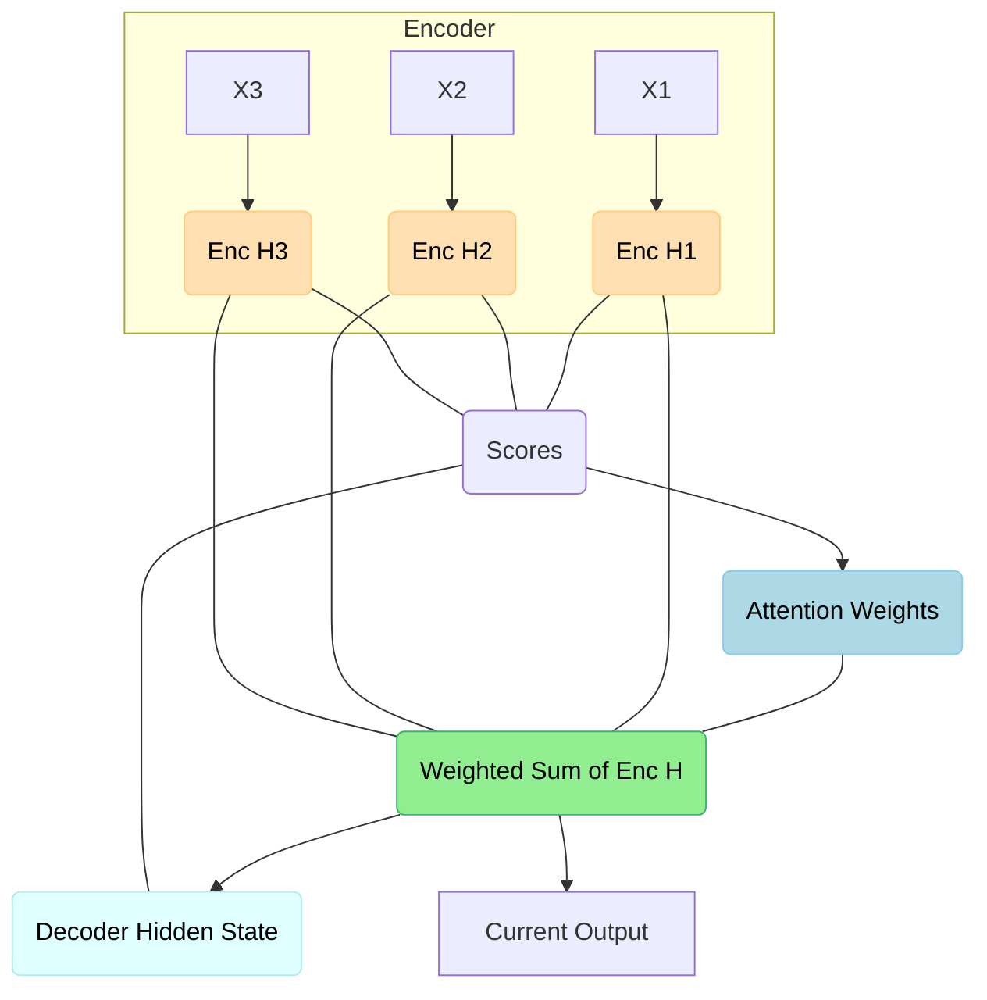

# Attention Mechanism

:::info[The Solution to the Bottleneck: Giving the Model "Eyes"]
In the last section, we saw that the Encoder-Decoder model has a major flaw: it forces all information into a single "bottleneck" context vector. The decoder is like a writer who was given a one-paragraph summary and then had the original book taken away.

**Attention** is the revolutionary idea that solves this. It gives the decoder "eyes" to look back at the *entire* source text at every step of the writing process. It allows the model to ask, "Which part of the original input is most relevant to the word I'm about to write?" This simple but powerful idea changed everything.
:::

The **Attention Mechanism** is one of the most significant innovations in deep learning for sequence modeling, particularly in Natural Language Processing (NLP). Introduced primarily to address the limitations of [Encoder-Decoder models with RNNs](../04-sequential-models/encoder-decoder-model.md), Attention allows a model to "pay attention" to (or weigh the importance of) different parts of an input sequence when generating an output. This dynamic focusing dramatically improved performance in tasks like machine translation and laid the foundation for the Transformer architecture.

## The Problem with Fixed-Size Context Vectors

Recall that in a traditional RNN-based Encoder-Decoder model, the encoder compresses the entire input sequence into a single, fixed-size **context vector**. This context vector then serves as the sole source of information for the decoder to generate the output sequence.

*   **Information Bottleneck**: For long input sequences, this fixed-size context vector becomes an information bottleneck. It's difficult to encode all relevant details of a long sentence into a single vector, leading to information loss, especially for earlier parts of the input.
*   **Difficulty with Long-Range Dependencies**: As the sequence length increases, the model struggles to remember and utilize information from distant past steps.

### How Attention Works (Conceptually)

:::tip[Analogy: The Human Translator with a Highlighter]
Imagine a human translating the French sentence: "Je suis étudiant."
*   When translating "I", they will pay high attention to "Je".
*   When translating "am", they will pay high attention to "suis".
*   When translating "student", they will pay high attention to "étudiant".

The attention mechanism works like this. For each word it generates, the decoder creates a "highlighter" (the attention weights) that emphasizes the most relevant words from the original input. The final context vector is a blend of the input words, with the highlighted words given the most importance.
:::

Instead of forcing the encoder to compress everything into one vector, the Attention Mechanism allows the decoder to directly access all of the encoder's hidden states (or a weighted sum of them) when producing each part of the output.

Here's the conceptual breakdown:

1.  **Encoder States**: The encoder processes the input sequence and produces a series of hidden states, one for each input token. These states represent information about the input at different points in time.
2.  **Decoder Query**: When the decoder is about to produce an output token, it generates a "query" (typically its current hidden state).
3.  **Alignment/Scoring**: This query is compared against all of the encoder's hidden states. A "score" (or "attention weight") is calculated for each encoder state, indicating how relevant that part of the input sequence is to the current decoding step.
4.  **Context Vector Creation**: These attention weights are normalized (e.g., using a softmax function) to sum to 1. A new, dynamic **context vector** is then created as a weighted sum of the encoder's hidden states, where the weights are the calculated attention scores.
5.  **Output Generation**: The decoder uses this new, dynamically created context vector (which is tailored to the current output step) along with its current hidden state to predict the next output token.

**Actionable Insight**: Attention allows the model to selectively focus on the most relevant input information, effectively creating a "shortcut" for information flow and bypassing the bottleneck of a single fixed-size context vector.

## Visual Suggestion: Attention Mechanism

## Types of Attention

While the core concept remains, various "flavors" of attention have been developed:

*   **Additive Attention (Bahdanau Attention)**: Uses a feedforward network to calculate alignment scores.
*   **Multiplicative Attention (Luong Attention)**: Computes scores as a dot product between hidden states.
*   **Self-Attention (Intra-Attention)**: A revolutionary variant where attention is applied within a single sequence to relate different positions of that same sequence, rather than between an input and an output sequence. This is the cornerstone of the Transformer architecture.

    :::info[The Most Important Innovation: Self-Attention]
    This is the big one. While previous attention mechanisms connected a decoder to an encoder, **self-attention** allows a model to look at other words *within the same sentence* to better understand the context of a given word.

    For example, in the sentence "The animal didn't cross the street because **it** was too tired," self-attention allows the model to learn that "**it**" refers to "the animal" and not "the street." This ability to resolve relationships within a single sequence is fundamental to how Transformers work and was a massive leap forward for language understanding.
    :::

## Relevance to Generative AI and LLMs

:::info[The Enabling Technology for Modern LLMs]
It is impossible to overstate the importance of Attention.
*   It solved the long-range dependency problem that plagued RNNs.
*   Its **self-attention** variant allowed for massive parallelization, as the model could process all words in a sequence at once, rather than one by one.

Without the Attention Mechanism, the Transformer architecture would not exist. And without Transformers, the large, powerful LLMs we have today would not be computationally feasible. Attention is the engine of the modern AI revolution.
:::

The Attention Mechanism was a game-changer. It directly addressed the long-standing problem of learning long-range dependencies in sequence models. Its ability to dynamically weigh input information significantly improved the quality of generated text and translations.

The most profound impact of Attention was its role in enabling the **Transformer architecture**. By allowing models to process all parts of a sequence in parallel (instead of sequentially like RNNs) and integrating self-attention, Transformers achieved unprecedented efficiency and performance, leading directly to the development of modern LLMs like BERT, GPT, and their successors.

## Next Steps

With Attention as a foundational concept, we are now ready to dive into the revolutionary [Transformer Model Architecture](./transformer-model-architecture.md).
---
