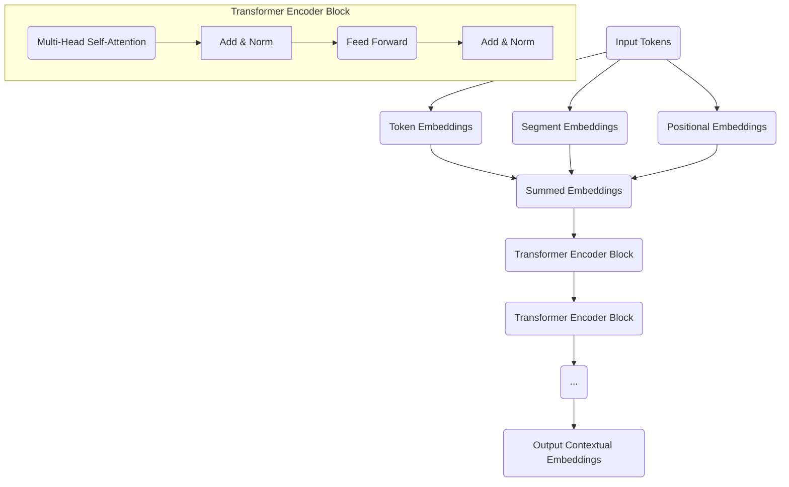

# BERT: Model Architecture

**BERT (Bidirectional Encoder Representations from Transformers)**, introduced by Google in 2018, marked a significant milestone in Natural Language Processing (NLP). It demonstrated the power of pre-training deep bidirectional representations from unlabeled text by jointly conditioning on both left and right context in all layers. BERT shattered performance records across many NLP benchmarks and became a foundational model, influencing the design of countless subsequent Large Language Models (LLMs).

## The Core Idea: Bidirectional Context

Prior to BERT, many pre-trained language models (like those in ULMFiT or early GPTs) were unidirectional, meaning they either processed text from left-to-right or right-to-left. This limited their ability to fully understand the context of a word. BERT overcame this by introducing **truly bidirectional context**.

*   **Actionable Insight**: By considering words to its left AND right simultaneously, BERT can disambiguate meaning more effectively and capture richer contextual representations. For example, understanding "bank" in "river bank" requires knowing "river," and understanding "bank" in "financial bank" requires knowing "financial."

## BERT's Architecture: The Transformer Encoder Stack

BERT's architecture is essentially a multi-layer **Transformer Encoder** stack. Unlike generative models like GPT which use the decoder stack, BERT exclusively uses the encoder.

### Visual Suggestion: BERT's Architecture

### Key Components

1.  **Input Embeddings**:
    *   **Token Embeddings**: Standard [sub-word embeddings](./sub-word-tokenization-bpe-wordpiece.md) for each token (e.g., WordPiece).
    *   **Segment Embeddings**: Identifies which sentence a token belongs to (useful for tasks involving two sentences, like Question Answering or Next Sentence Prediction).
    *   **Positional Embeddings**: As in all Transformers, these are added to inject information about the token's position in the sequence, as the Transformer itself is permutation-invariant.
    *   **Special Tokens**:
        *   `[CLS]`: A special classification token added at the beginning of the input. The final hidden state corresponding to this token is used as the aggregate sequence representation for classification tasks.
        *   `[SEP]`: A separator token used to distinguish between two segments in the input (e.g., question and paragraph).
        *   `[PAD]`: Padding token to make all input sequences the same length.

2.  **Transformer Encoder Blocks**: BERT consists of multiple (e.g., 12 for `BERT_base`, 24 for `BERT_large`) identical Transformer Encoder blocks stacked on top of each other. Each block contains:
    *   **Multi-Head Self-Attention**: Allows the model to weigh the importance of different tokens in the input sequence when processing a particular token. Crucially, this attention is **bidirectional**, meaning a token can attend to all tokens to its left and right.
    *   **Feed-Forward Network**: A position-wise fully connected feed-forward network.
    *   **Residual Connections and Layer Normalization**: Applied after each sub-layer to stabilize training.

## BERT's Pre-training Objectives

BERT was pre-trained on a massive dataset (BooksCorpus + English Wikipedia) using two unsupervised tasks:

1.  **Masked Language Model (MLM)**:
    *   **How it Works**: Around 15% of the tokens in the input sequence are randomly masked (replaced with `[MASK]`). BERT's objective is to predict these masked tokens based on their full context (both left and right).
    *   **Actionable Insight**: This task forces the model to learn a deep, bidirectional understanding of language. It's the key innovation that enables BERT's contextualization.

2.  **Next Sentence Prediction (NSP)**:
    *   **How it Works**: The model is fed pairs of sentences. For 50% of the pairs, the second sentence is indeed the next sentence in the document. For the other 50%, it's a random sentence. BERT predicts whether the second sentence logically follows the first.
    *   **Actionable Insight**: This task helps BERT understand relationships between sentences, which is crucial for tasks like question answering and document summarization.

## Fine-tuning BERT for Downstream Tasks

After pre-training, BERT's weights are fine-tuned for specific downstream NLP tasks. This involves adding a small, task-specific output layer on top of the pre-trained BERT model.

*   **Classification Tasks**: The final hidden state of the `[CLS]` token is typically fed into a simple feed-forward layer with a softmax activation to predict a class label.
*   **Question Answering**: BERT predicts the start and end tokens of the answer span within a given paragraph.
*   **Named Entity Recognition**: BERT predicts a tag for each token in the input sequence.

## Relevance to Generative AI and LLMs

BERT's introduction of truly bidirectional contextual embeddings through the Transformer Encoder and its self-supervised pre-training tasks fundamentally changed the landscape of NLP. While models like GPT excel at generation (using a decoder-only architecture), BERT demonstrated how large, pre-trained Transformer Encoders could achieve remarkable understanding and discriminative capabilities. BERT-like architectures are still widely used for tasks requiring deep language understanding, and the pre-training techniques it pioneered (like MLM) continue to influence the development of all LLMs.

## Next Steps

This concludes our detailed exploration of the Attention Mechanism and Transformer architectures. Now that we have covered the foundational NLP and sequential models, we will move to **[Introduction to Generative AI](../01-generative-ai-introduction/introduction.md)**.
---
