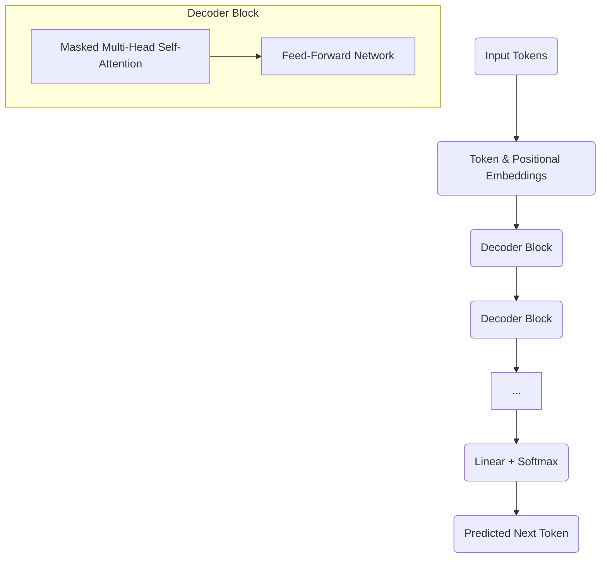

# Generative Pre-training: Model Architecture

The paradigm of **Generative Pre-training** has been a monumental shift in Natural Language Processing (NLP), directly leading to the development of powerful Large Language Models (LLMs) like OpenAI's GPT series. This approach involves training a massive language model on a vast amount of unlabeled text data in an unsupervised manner, primarily to learn to predict the next token in a sequence. The architectural choices made for this pre-training are crucial for the model's emergent generative capabilities.

## The Core Idea: Unsupervised Language Modeling

Before generative pre-training became dominant, most NLP models were task-specific. You would train a sentiment analysis model on labeled sentiment data, a translation model on parallel corpora, etc. Generative pre-training flips this by:

1.  **Pre-training**: Training a single, large model on a massive, diverse, unlabeled text corpus (e.g., the entire internet). The task is typically **language modeling**, where the model learns to predict the next word/token given the preceding ones. This forces the model to learn grammar, facts, common sense, and various writing styles implicitly.
2.  **Fine-tuning (Optional but Common)**: Adapting the pre-trained model to a specific downstream task (e.g., text classification, question answering) using a smaller labeled dataset. This is done by adding a small task-specific layer on top of the pre-trained model and training it further.

The architectural choice for this pre-training phase is critical.

## Architectural Foundation: The Transformer Decoder

Most modern generative pre-training models, especially those designed for text generation, are built upon the **Decoder-only stack** of the [Transformer Architecture](./transformer-model-architecture.md).

### Why the Decoder-only Architecture?

The Transformer Decoder is inherently suited for generative tasks because of its **masked self-attention mechanism**.

*   **Masked Self-Attention**: Unlike the encoder's self-attention, the decoder's self-attention layers are "masked" so that each position can only attend to earlier positions in the output sequence. This prevents the model from "cheating" by looking at future tokens when predicting the current one, making it ideal for sequential generation.
*   **Autoregressive Nature**: This masking enforces an autoregressive property, meaning the model predicts the next token based solely on the tokens it has already generated. This is precisely what's needed for tasks like text completion or story generation.

### Components of a Generative Pre-trained Model (Decoder-only Transformer)

A typical generative pre-trained model architecture looks like a stack of identical decoder blocks from the original Transformer, but *without* the additional encoder-decoder attention mechanism (since there's no separate encoder output to attend to).

**Visual Suggestion**: A simplified diagram showing a stack of identical "Decoder Block" units, with input text flowing in, and output text flowing out. Each block contains Masked Multi-Head Self-Attention, followed by a Feed-Forward Network, with residual connections and layer normalization.

### Process Flow for Text Generation

1.  **Input**: A sequence of input tokens (e.g., a prompt).
2.  **Embeddings**: Input tokens are converted into embeddings (token embeddings + positional embeddings).
3.  **Decoder Stack**: These embeddings pass through multiple layers of the Transformer decoder stack. At each layer, the masked self-attention mechanism processes the sequence.
4.  **Prediction**: The final layer's output for the last token in the sequence is fed through a linear layer and a softmax function to predict the probability distribution over the entire vocabulary for the next token.
5.  **Sampling**: A token is sampled from this distribution (e.g., using greedy sampling, beam search, or nucleus sampling).
6.  **Autoregressive Loop**: The newly predicted token is then appended to the input sequence, and the entire process repeats to predict the next token, continuing until an end-of-sequence token is generated or a maximum length is reached.

## Actionable Insight: The Power of Self-Supervision

The success of generative pre-training lies in its ability to leverage vast amounts of unlabeled data through a self-supervised task (language modeling). This means human annotation is not required for the primary training phase, allowing for massive scaling and the discovery of intricate linguistic patterns.

## Relevance to Modern LLMs

This architectural paradigm, especially the decoder-only Transformer, is the cornerstone of contemporary LLMs optimized for generation. Models like GPT-2, GPT-3, GPT-4, Llama, Falcon, and many others are direct descendants of this architectural concept. Their ability to generate human-like text, code, and creative content stems from the deep, broad language understanding acquired during generative pre-training on this specific architecture.

## Next Steps

A crucial aspect of preparing text for these models is efficient representation. We'll explore this further in **[Sub-Word Tokenization, BPE, WordPiece](./sub-word-tokenization-bpe-wordpiece.md)**.
---