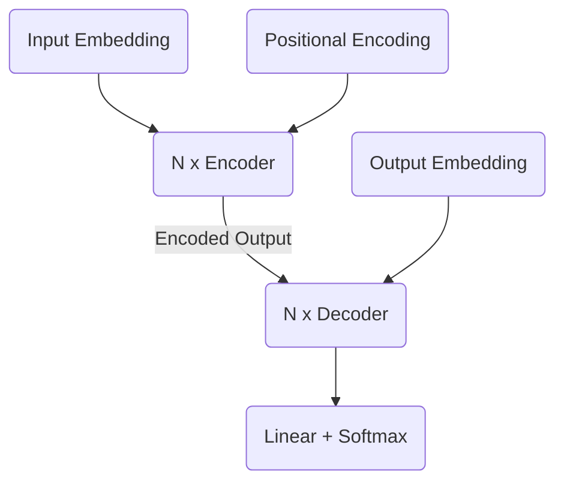

# Transformer Model Architecture

:::note A Paradigm Shift: From Sequential to Parallel
The Transformer is not just an improvement on the RNN; it's a complete **paradigm shift**.

*   **RNNs** read a sentence one word at a time, like a person reading through a long, narrow tube. Their understanding of the first word is fuzzy by the time they reach the last.
*   **Transformers** read the entire sentence at once, like a person looking at a whole page. Through **Self-Attention**, every word can directly look at and compare itself to every other word, no matter how far apart they are.

This ability to process in **parallel** rather than **sequentially** is the core breakthrough that made modern LLMs possible.
:::

The **Transformer** model, introduced in the 2017 paper "Attention Is All You Need" by Vaswani et al., revolutionized sequence modeling and became the dominant architecture in Natural Language Processing (NLP). It completely abandoned Recurrent Neural Networks (RNNs) and Convolutional Neural Networks (CNNs), relying solely on the [Attention Mechanism](./attention-mechanism.md) to draw global dependencies between input and output. This breakthrough enabled unprecedented parallelization, leading to faster training times and the ability to handle much longer sequences, paving the way for modern Large Language Models (LLMs).

## Key Innovations of the Transformer

:::info The "Secret Sauce": Position + Attention
The two most important innovations work together to overcome the RNN's limitations:
1.  **Self-Attention** lets every word look at every other word, so the model understands relationships regardless of distance.
2.  **Positional Encodings** give the model a sense of word order.

This combination is the Transformer's "secret sauce": it gets the sequence awareness of an RNN and the parallel processing of a non-sequential model, achieving the best of both worlds.
:::

The Transformer's success stems from several key architectural innovations:

1.  **Self-Attention (Multi-Head Attention)**: The most crucial component. Instead of processing a sequence word by word, Self-Attention allows the model to weigh the importance of all other words in the input sequence when encoding a single word. Multi-Head Attention applies this process multiple times in parallel, allowing the model to focus on different aspects of relationships.
2.  **Positional Encoding**: Since the Transformer does not use recurrence or convolution, it needs a way to account for the order of words in the sequence. Positional encodings are vectors added to the input embeddings that provide information about the absolute or relative position of each token.
3.  **Feed-Forward Networks**: Each Encoder and Decoder block contains a simple, position-wise fully connected feed-forward network applied independently to each position.
4.  **Layer Normalization and Residual Connections**: Used throughout the network to stabilize training and enable the training of very deep models.

## The Transformer Architecture: An Overview

The Transformer follows the traditional Encoder-Decoder structure for sequence-to-sequence tasks, but with significant internal differences.

### Visual Suggestion: High-Level Transformer Architecture

### 1. The Encoder Stack

The encoder is responsible for mapping an input sequence of symbol representations $(x_1, ..., x_n)$ to a sequence of continuous representations $(z_1, ..., z_n)$.

*   It consists of a stack of $N$ identical layers (e.g., $N=6$).
*   Each layer has two sub-layers:
    1.  **Multi-Head Self-Attention Mechanism**: Computes attention over the input sequence itself.
    2.  **Position-wise Feed-Forward Network**: A simple fully connected network.
*   Each sub-layer is followed by a **Residual Connection** and **Layer Normalization**.

### 2. The Decoder Stack

The decoder is responsible for taking the encoder's output and the previously generated symbols to generate the output sequence $(y_1, ..., y_m)$.

*   It also consists of a stack of $N$ identical layers.
*   Each layer has three sub-layers:
    1.  **Masked Multi-Head Self-Attention**: Similar to the encoder's self-attention, but it's "masked" to prevent attending to future positions (to ensure prediction depends only on known outputs).
    2.  **Multi-Head Attention over Encoder Outputs**: This layer performs attention over the output of the *encoder stack*, allowing the decoder to focus on relevant parts of the input sequence.
    3.  **Position-wise Feed-Forward Network**: Same as in the encoder.
*   Again, each sub-layer is followed by a **Residual Connection** and **Layer Normalization**.

## Deeper Dive: Multi-Head Self-Attention

:::tip Analogy: A Committee of Experts
**Self-Attention** is like one person reading a sentence to understand its internal references.

**Multi-Head Attention** is like a committee of experts reading the sentence simultaneously. Each "head" is an expert in a different type of relationship:
*   **Head 1 (The Linguist):** Looks at grammatical structure.
*   **Head 2 (The Historian):** Looks for connections to known facts.
*   **Head 3 (The Storyteller):** Looks for narrative flow.
*   ...and so on.

By combining the perspectives of all these experts, the model gets a much richer and more nuanced understanding of the text.
:::

Self-Attention computes a weighted sum of all values in the input sequence, where the weight assigned to each value is determined by a "query" and a "key" vector derived from each word.

The core idea: For each word, calculate three vectors:
*   **Query (Q)**: Represents what information this word is looking for.
*   **Key (K)**: Represents what information this word offers.
*   **Value (V)**: The actual information content of this word.

The attention score is typically calculated as `softmax((Q * K^T) / sqrt(d_k)) * V`.

**Multi-Head Attention** extends this by performing the attention function `h` times in parallel with different learned linear projections to Query, Key, and Value. The outputs from these `h` attention heads are then concatenated and linearly transformed into the final output. This allows the model to learn different types of relationships (e.g., syntactic, semantic) simultaneously.

**Actionable Insight**: The ability of Self-Attention to capture global dependencies in a single step (unlike RNNs that process sequentially) is what makes Transformers so powerful for long-range context.

## Positional Encoding Explained

Without recurrence or convolutions, a Transformer would treat all words in a sequence as an unordered set (like a Bag-of-Words model). Positional encodings provide the necessary sequential information.

*   **How it Works**: These are sine and cosine functions of different frequencies. They are added directly to the input embeddings (after converting words to vectors).
*   **Why it works**: This allows the model to infer the relative positions of words and integrate this information into the attention mechanism.

## Relevance to Generative AI and LLMs

The Transformer architecture is the **foundational technology** for almost all modern Large Language Models (LLMs). Its parallel processing capabilities, combined with the power of self-attention to capture complex, long-range dependencies, enabled models to scale to unprecedented sizes and training data volumes.

*   **BERT (Encoder-only)**: Models like BERT use only the Transformer's encoder stack for tasks like text classification, question answering, and named entity recognition.
*   **GPT (Decoder-only)**: Generative models like OpenAI's GPT series primarily use a modified version of the Transformer's decoder stack (without the encoder-attention layer), focusing on autoregressive generation (predicting the next token based on previous ones).

    :::info Why "Decoder-Only"?
    This is a common point of confusion. A model like GPT is called "decoder-only" because its primary job is to **generate text** by predicting the next word. It doesn't need to translate from a *different* source language.
    *   It still uses the core components of a Transformer decoder: **Masked Self-Attention** to look at the previous words it has already written.
    *   It lacks the second **Multi-Head Attention** layer that would have looked at an encoder's output, because there *is* no encoder.
    Its only "source" is the text it has generated so far.
    :::

The Transformer's ability to "see" the entire sequence at once (or at least, to quickly compute relationships across it) is what gives LLMs their remarkable contextual understanding and generative fluency.

## Next Steps

Now that you understand the architecture, we'll explore how these models create rich representations of language in [Embeddings from Language Model](./embeddings-from-language-model.md).
---